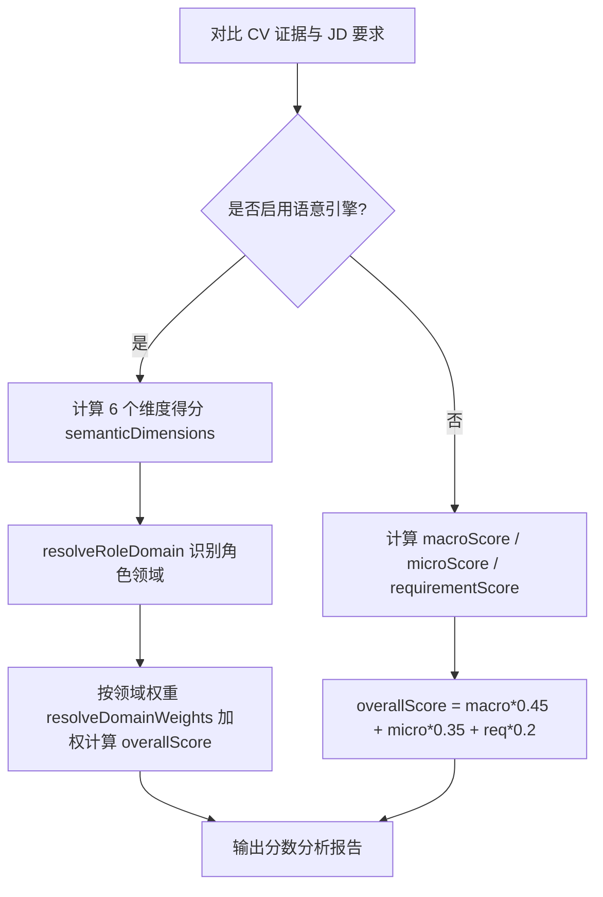

# CV-JD 匹配比對與評分管道 (CV-JD Matching & Scoring Pipeline)

本文件詳細記錄了系統如何讀取 CV 與 JD 解析數據、進行多維度語意比對、計算匹配分數與置信度，並說明如何進行質量評測與時延 (Latency) 追蹤的完整技術細節。

---

## 1. 數據提取與加載 (Data Retrieval & Loading)

在進行 CV-JD Match 時，後端 API 進入點為 `POST /api/analyze/match`（對應 [analyzeController.js](file:///Users/heminghan/Kiwi-AI-interview-Agent/backend/src/controllers/analyzeController.js) 中的 `matchCV`）。
系統主要從 MongoDB 中提取已通過 Human Review 審查確認的兩類數據：

1. **Reviewed CV Profile**：
   - 提取自 MongoDB 的 `DocumentContent` 集合。
   - 包含由用戶審核確認後的結構化 Profile (`cvProfile`)、細化證據剖析 (`evidenceProfile`) 以及拼接後的審查全文 `reviewedText`。
2. **Reviewed JD Rubric**：
   - 提取自 MongoDB 的 `CompanyValuesProfile` 集合（由 `jdFingerprint` 檢索）。
   - 包含經人工審查確認的 `jdRubric`（內含職責要求、技能指標及角色契合特徵 `roleFit`）。

---

## 2. 比對維度與方法 (Comparison Dimensions & Methods)

比對邏輯在 [matchService.js](file:///Users/heminghan/Kiwi-AI-interview-Agent/backend/src/services/matchService.js) 的 `compareCvToJobDescription` 中啟動，並支持兩種匹配引擎（由配置決定是否啟用語意匹配）：

### 2.1 比對引擎分類

* **語意匹配引擎 (Semantic Match Engine)** (默認或 `MATCH_ENGINE = semantic`)：
  1. **角色肖像提煉 (Role Profile)**：調用 `buildUniversalRoleProfile` 對 JD 進行深層解構。
  2. **語意特徵搜索**：調用 [semanticEvidenceService.js](file:///Users/heminghan/Kiwi-AI-interview-Agent/backend/src/services/match/semanticEvidenceService.js) 中的 `buildSemanticEvidenceContext`。
     - **向量相似度比對**：若 `MATCH_ENGINE === 'semantic'`，調用 [huggingFaceEmbeddingService.js](file:///Users/heminghan/Kiwi-AI-interview-Agent/backend/src/services/match/huggingFaceEmbeddingService.js) 使用 Hugging Face 模型將 JD 要求與 CV 證據向量化，計算**餘弦相似度 (Cosine Similarity)**。
     - **確定性降級方案 (Deterministic Fallback)**：若 Hugging Face 失敗或未配置，調用 [embeddingService.js](file:///Users/heminghan/Kiwi-AI-interview-Agent/backend/src/services/embeddingService.js) 的 `buildDeterministicEmbedding` 基於哈希與 N-gram 構建確定性向量（模型為 `weighted_hash_ngram_v2`）。
* **默認/關鍵字比對引擎 (Default Engine)**：
  - 僅基於基礎 Rubric 關鍵字與章節覆蓋度進行對比。

### 2.2 比對核心技術與有用性保障 (Usefulness Guards)

為確保比對的真實性與準確度，系統實現了多項過濾與防禦機制：

1. **語意別名擴展 (Semantic Alias Expansion)**：
   - 在 [semanticMatchService.js](file:///Users/heminghan/Kiwi-AI-interview-Agent/backend/src/services/match/semanticMatchService.js) 中，通過 `SEMANTIC_ALIAS_MAP` 對技術名詞做同義擴展（例如 `sql` 自動關聯 `postgresql`, `postgres`, `mysql`, `database query` 等；`api development` 關聯 `rest endpoints`），避免因字眼不同造成漏判。
2. **文本重疊度評估 (Text Overlap)**：
   - 通過 `overlapScore` 計算單字交集比例（過濾常見停用字如 `and`, `the` 等），綜合權衡「向量相似度」與「單詞匹配度」：`score = Math.max(cosineSimilarity, overlapScore)`。
3. **硬性技術要求校驗 (Strict Tech Check)**：
   - 針對必須具備的技術要求 (mustHave)，在 `matchScoringService.js` 中調用 `hasStrictTechEvidence`，強制使用嚴格的正則規則（`STRICT_TECH_PATTERNS`）校驗 CV 原文。若無具體提及（例如只寫了 general experience 而無實質技術棧），將被降級為 `not_met`。
4. **章節防衛過濾 (Heading Guard)**：
   - 透過 `isJobDescriptionSectionHeading` 排除 JD 本身的章節標題（例如 `Skills & Experience:`、`Roles & Responsibilities:`），防止其進入語意搜索和評分目標。

---

## 3. 分數與評分機制計算 (Scoring Calculations)

評分管道由 [matchScoringService.js](file:///Users/heminghan/Kiwi-AI-interview-Agent/backend/src/services/match/matchScoringService.js) 實作：

### 3.1 語意匹配評分 (Semantic Domain Scoring)
當啟用語意引擎時，系統將分析六個特徵維度 (`semanticDimensions`)：
1. `mustHaveFit`：硬性/必備要求契合度（對 `hardBlocker` 節區的權重加成）。
2. `responsibilityFit`：日常職責契合度（對 `responsibility` 節區的權重加成）。
3. `skillAndToolFit`：技術技能與工具契合度（對 `skillTool` 節區的權重加成）。
4. `domainSpecificFit`：特定領域契合度。
5. `evidenceQuality`：證據質量分（強證據 `strong` 得 100 分，部分 `partial` 得 72 分，弱 `weak` 得 38 分，缺失 `missing` 得 0 分）。
6. `softSkillAndCultureFit`：軟實力與文化契合度。

**加權分數計算**：
系統通過 `resolveRoleDomain` 識別 JD 的工作範疇（如 `software_it`, `data_ai`, `business_operations` 等），並在 `DOMAIN_SCORE_WEIGHTS` 查找對應權重進行加權求和。例如，`software_it` 領域的總分權重比例如下：
* `mustHaveFit` (必備項): **30%**
* `skillAndToolFit` (技能工具): **25%**
* `responsibilityFit` (工作職責): **20%**
* `softSkillAndCultureFit` (軟實力): **10%**
* `evidenceQuality` (證據質量): **10%**
* `domainSpecificFit` (領域專屬性): **5%**

### 3.2 基礎評分 (Default Scoring)
如果未啟用語意引擎，系統使用經典比例評分：
* `overallScore = macroScore * 45% + microScore * 35% + requirementScore * 20%`
* 項目狀態分值：`met` = 1.0, `partial` = 0.6, `inferred` = 0.25, `not_met` = 0.0。
* 權重調節：高重要度乘以 1.5，低重要度乘以 0.75，中重要度乘以 1.0。

---

## 4. 置信度計算 (Match Confidence)

匹配置信度 (`confidence`) 衡量了「比對結果的可信度與履歷細節的飽滿度」，由 [matchResultBuilder.js](file:///Users/heminghan/Kiwi-AI-interview-Agent/backend/src/services/match/matchResultBuilder.js) 中的 `calculateConfidence` 函數計算。

### 4.1 計算公式與因子

置信度的基礎值 (`base`) 最高為 **0.95**，由以下正面特徵累加得出：
* **基礎值偏置**：`0.32`
* **標準數量指標**：`+ Math.min(0.22, ((macroScores.length + microScores.length) / 20) * 0.22)`
* **有效證據覆蓋量**：`+ Math.min(0.18, 具備證據的檢查項數量 * 0.035)`
* **履歷長度**：`+ Math.min(0.13, 履歷單字數 / 8000)`
* **項目豐富度**：`+ Math.min(0.1, 專案數量 * 0.03)`
* **成就與結果**：`+ Math.min(0.08, 成就數量 * 0.02)`

### 4.2 扣分處罰 (Penalties)

若比對中出現疑點，會從上述基礎值中扣減：
1. **硬性指標缺失扣分 (Missing Hard Blocker)**：
   - mustHave 要求未被滿足，且該要求屬於技術硬指標。
   - 處罰係數：`Math.min(0.18, 缺失硬指標個數 * 0.025)`。
2. **證據矛盾扣分 (Contradiction)**：
   - 出現不一致現象（例如：雖然標記為 `not_met`，但關聯的證據強度卻是 `strong`；或者標記為 `met`，但 missingEvidence 欄位卻不為空）。
   - 處罰係數：`Math.min(0.16, 矛盾項個數 * 0.04)`。
3. **技術證據軟弱扣分 (Weak Hard Evidence)**：
   - 必備的硬指標雖然匹配到了，但其證據強度為 `'weak'`（如只出現在自我評價中，無工作經歷或專案佐證）。
   - 處罰係數：`Math.min(0.08, 弱指標個數 * 0.02)`。

最終置信度為：`Math.max(0.35, base - penalties)`，確保其在 `0.35` 到 `0.95` 之間。

---

## 5. 評估評測 (Evaluation)

為確保比對的質量， Kiwi 專案採用了幾套評測方案（位於 `backend/eval` 下）：

1. **檢索質量評測 (`eval:retrieval`)**：
   - 使用 15 個真實檢索場景評估檢索準確度。主要度量指標包含：
     - **Coverage Rate (覆蓋率)**：檢索出的段落是否涵蓋全部必備硬技能。
     - **Citation Accuracy (引用準確度)**：引用的原文段落是否與要求精準對齊。
     - **Hallucination Rate (幻覺率)**：檢索結果中是否存在無中生有的生成內容。
     - **Agent Disagreement Rate (決策分歧率)**：AI 裁判與系統硬性匹配的偏差。
2. **人工校準與發布門檻 (`eval:calibration`)**：
   - 通過 `humanReview` 人工標註 12 個代表性匹配案例，將 AI 評判結果與人工覆核結論進行逐一對照。
   - 設置發布門檻：**`thresholdDecision = 0.85`**（AI 判定與人工校準的一致性需達 85% 以上），由雙人審核簽章方能解除發布 block。
3. **對抗性魯棒評測 (`eval:role-fit-v2-adversarial`)**：
   - 提供 12 個包含極端或邊界條件的測試集，驗證在惡意/混淆輸入下匹配引擎的穩定性。

---

## 6. 時延計算 (Latency Calculation)

比對時延追蹤利用 Node.js 高精度時間戳 `process.hrtime.bigint()` 進行無感採集（代碼見 [matchPerformanceTraceService.js](file:///Users/heminghan/Kiwi-AI-interview-Agent/backend/src/services/match/matchPerformanceTraceService.js)）：

1. **時延採集管道**：
   - 比對開始時調用 `createMatchPerformanceTrace` 紀錄起點納秒時間 `startedAtMs`。
   - 使用 `measureMatchStep(trace, step, fn)` 包裹各個核心運算步驟（如 `normalize_jd_rubric`、`semantic_role_profile`、`semantic_evidence_context`、`semantic_evidence_judge`、`match_score_build`、`role_evidence_map_build`、`match_result_build`），在其執行完畢後計算耗時：
     $$\text{durationMs} = \text{nowMs} - \text{startedStepAtMs}$$
2. **數據統計與聚合**：
   - 時延追蹤在比對完成時，會生成 `match_performance_trace_v1` JSON 結構，並寫入 PostgreSQL 數據庫的 `MatchAnalysisRecord` 中：
     - `totalMs`：比對總耗時。
     - `stepSummary`：聚合每個步驟的調用次數、成功率、最大耗時及平均耗時。
     - `slowestSteps`：按照 `durationMs` 從大到小排序的慢步驟列表（最多列出 8 個）。
   - 在比對完成後，後端日誌中會自動列印完整的性能追蹤摘要，便於直接定位網絡請求或 LLM 判斷的慢點。

---

## 7. 容易忽視的開發與運作邊界 (Key Operations & Development Caveats)

1. **AI 評判的確定性繞過 (Local Heuristic Bypass)**：
   - 為了大幅減低延遲與節約 API 費用，系統不會將所有的匹配判定都發送給 LLM！
   - 當最優候選證據的語意相似分數超強（$\ge 0.82$）、極弱（$\le 0.45$）或者完全沒有提取出匹配證據時，系統直接在 [evidenceJudgeService.js](file:///Users/heminghan/Kiwi-AI-interview-Agent/backend/src/services/match/evidenceJudgeService.js) 判定並標記為本地路由 (`routedLocally: true`)，直接繞過 AI 服務。
2. **防線安全帽限制 (Safety Cap on Match Strength)**：
   - 如果本地對比結果顯示 CV 原文證據極弱（例如只是一句自我評價，無實際工作經歷），即使 AI 評判 (DeepSeek) 給出了 `met` (高分)，合併邏輯也會啟動防衛機制，強制將最終狀態和強度 cap 限制在 `fallback.status`（不允許 AI 強行將弱證據升格）。
3. **性能痕跡不寫入快取 (Performance Trace Excluded from Cache)**：
   - 儘管整個比對過程會生成詳細的 `performanceTrace`（包含每步毫秒數、最慢環節），但此痕跡是 request-scoped 的，**不會**被寫入用於重複請求的 `match_cache` 中，確保性能統計數據的即時性。
4. **與問題準備的無縫對接**：
   - 匹配產出的 `roleEvidenceMap` 和 `requirementChecks` 決定了接下來面試的「重點追問區」與「缺口覆蓋項 (Gap Area)」。缺失 (not_met) 或推導 (inferred) 的要求會成為後續 question pool 中的重點過濾器，直接驅動面試問題的動態生成。

