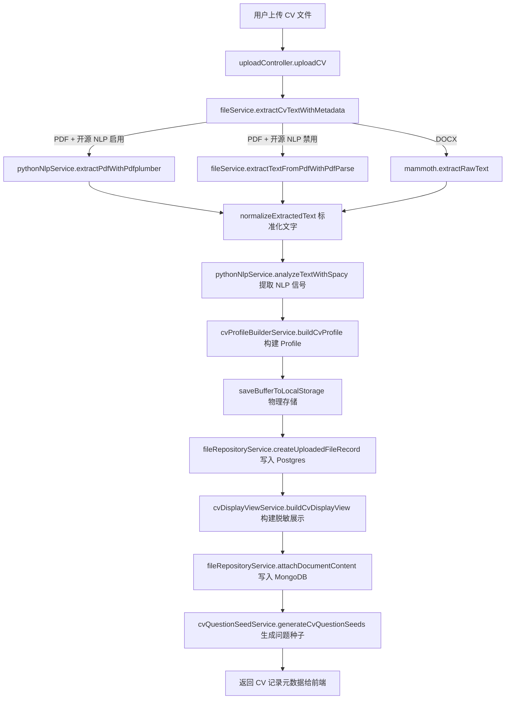
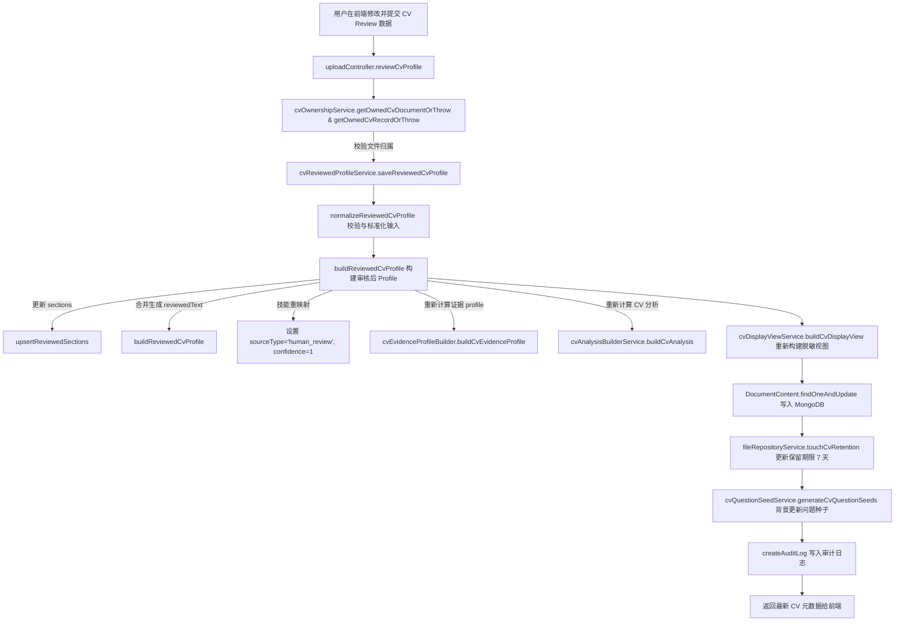

# CV 解析與審核代碼管道 (CV Parsing & Review Code Pipeline)

本文件詳細記錄了用戶上傳 CV（履歷）後系統的解析流程、所提取的結構化欄位，以及經過 Human Review（人工審核）後資料是如何保存與更新至資料庫的完整代碼管道。

---

## 1. CV 上傳與解析流程 (CV Upload & Parsing Flow)

當用戶在前端上傳履歷文件時，請求將發送至後端 API：`POST /api/upload/cv`。該請求由 [uploadController.js](file:///Users/heminghan/Kiwi-AI-interview-Agent/backend/src/controllers/uploadController.js) 中的 `uploadCV` 處理器進行編排，具體處理管道如下：

### 1.1 核心步驟解析

1. **接收檔案與提取文字 (Text Extraction)**：
   - 委託給 [fileService.js](file:///Users/heminghan/Kiwi-AI-interview-Agent/backend/src/services/fileService.js) 的 `extractCvTextWithMetadata`。
   - **PDF 檔案**：如果環境變數 `ENABLE_OPEN_SOURCE_NLP` 為 `true`，系統優先調用 [pythonNlpService.js](file:///Users/heminghan/Kiwi-AI-interview-Agent/backend/src/services/pythonNlpService.js) 的 `extractPdfWithPdfplumber` 使用 Python `pdfplumber` 進行高精準解析。否則，降級使用 JavaScript 的 `pdf-parse` 工具包。
   - **DOCX 檔案**：使用 `mammoth` 庫的 `extractRawText` 提取純文字。
   - 提取的文本均通過 `normalizeExtractedText` 進行換行與空白符號的標準化。
2. **語意特徵分析 (NLP Signals)**：
   - 調用 [pythonNlpService.js](file:///Users/heminghan/Kiwi-AI-interview-Agent/backend/src/services/pythonNlpService.js) 的 `analyzeTextWithSpacy` 運行 spaCy 模型，提取實體 (Entities)、名詞片語 (Noun Chunks)、動作動詞 (Action Verbs) 及數值斷言 (Numeric Claims)，作為後續證據強度分析的基礎特徵。
3. **構建結構化 Profile (Profile Building)**：
   - 調用 [cvProfileBuilderService.js](file:///Users/heminghan/Kiwi-AI-interview-Agent/backend/src/services/cv/cvProfileBuilderService.js) 的 `buildCvProfile` 進行結構化映射。
   - 該服務利用關鍵字正則匹配（如 `experience`、`skills`、`education` 等）將履歷切分為多個 `sections`，並匹配 `cvSkillTaxonomy.js` 中的技術技能標籤。
   - 內部進一步調用 [cvEvidenceProfileBuilder.js](file:///Users/heminghan/Kiwi-AI-interview-Agent/backend/src/services/cv/cvEvidenceProfileBuilder.js) 的 `buildCvEvidenceProfile`，提取量化證據 (`quantifiedEvidence`)、評估候選人能力，並生成私有的履歷證據圖特徵 `candidateEvidenceGraph`。
4. **檔案物理儲存與元數據寫入 (PostgreSQL)**：
   - 通過 `saveBufferToLocalStorage`（對應 [storageService.js](file:///Users/heminghan/Kiwi-AI-interview-Agent/backend/src/services/storageService.js)）將檔案寫入本地硬碟（預設 `cv` 資料夾）。
   - 調用 `createUploadedFileRecord` 在關係型資料庫 **PostgreSQL** 的 `uploaded_files` 表中創建一筆檔案紀錄（設置 `file_role = 'cv'`，且預設 7 天後過期：`expires_at = now() + interval '7 days'`）。
5. **構建脫敏展示視圖 (Redacted Display View)**：
   - 調用 [cvDisplayViewService.js](file:///Users/heminghan/Kiwi-AI-interview-Agent/backend/src/services/cv/cvDisplayViewService.js) 的 `buildCvDisplayView` 產出用於前端列表展示的脫敏資料，對 `email` 和 `phone` 進行掩碼處理（例如遮蔽大部分字元，僅保留前兩位或後四位）。
6. **寫入文檔內容紀錄 (MongoDB)**：
   - 調用 [fileRepositoryService.js](file:///Users/heminghan/Kiwi-AI-interview-Agent/backend/src/services/fileRepositoryService.js) 的 `attachDocumentContent`。
   - 在 **MongoDB** 的 `DocumentContent` 集合中插入或更新一筆以 `fileId` 為主鍵的紀錄，保存原始文字、結構化 Profile 與脫敏 Profile。
7. **背景非同步生成問題種子 (Question Seeds)**：
   - 調用 [cvQuestionSeedService.js](file:///Users/heminghan/Kiwi-AI-interview-Agent/backend/src/services/questions/cvQuestionSeedService.js) 的 `generateCvQuestionSeeds`。根據剛剛解析出的結構化資訊，預先在資料庫中準備後續面試的題目素材。

---

## 2. 解析提取的欄位 (Extracted Fields)

系統解析出的資料主要保存在 MongoDB 中 [documentContentModel.js](file:///Users/heminghan/Kiwi-AI-interview-Agent/backend/src/db/models/documentContentModel.js) 的 `cvProfile` 與 `displayProfile` 欄位中，具體結構如下：

### 2.1 `cvProfile` (結構化履歷模型)

| 欄位名稱 | 類型 | 說明 |
| :--- | :--- | :--- |
| `schemaVersion` | String | 預設為 `'cv_profile_v1'`。 |
| `candidateName` | String | 提取自履歷首行非空文字，通過正則與長度校驗。失敗時降級為 `'Candidate'`。 |
| `rawLength` | Number | 原始履歷文字的字元長度。 |
| `tokenCount` | Number | 履歷的單字數估算值。 |
| `contact` | Object | 聯絡資訊，包含 `email`、`phone`、`location`（通過正則及預設地理關鍵字篩選）。 |
| `personalStatement` | String | 個人陳述，截取自 `personal_statement` 章節前 800 字。 |
| `summary` | String | 概要資訊，截取自 `summary` 或 `personal_statement` 章節前 500 字。 |
| `experience` | String | 工作經歷純文字，截取自 `experience` 章節前 1200 字。 |
| `education` | String | 教育背景純文字，截取自 `education` 章節前 800 字。 |
| `projects` | String | 專案經歷純文字，截取自 `projects` 章節前 1000 字。 |
| `certifications` | String | 證照與培訓資訊，截取自 `certifications` 章節前 500 字。 |
| `keyCompetencies` | String | 核心能力純文字，截取自 `key_competencies` 章節前 1000 字。 |
| `volunteer` | String | 志工經驗純文字，截取自 `volunteer` 章節前 600 字。 |
| `skills` | Array | 提取到的技能列表。每個元素為 `{ label, sourceType: 'taxonomy_keyword_match', confidence: 0.7 }`。 |
| `sections` | Array | 大綱章節劃分。結構如 `[{ key: 'experience', title: 'Work Experience', content: '...', lineCount: 15 }]` |
| `evidenceMap` | Array | 技能與履歷對應章節及片段的映射表。如 `[{ label: 'React', sourceSection: 'experience', sourceSnippet: '...', confidence: 0.7 }]`。 |
| `parserMetadata` | Object | 解析器元數據，如使用的 Python/JS parser 與 spaCy 模組資訊。 |
| `warnings` | Array | 系統檢測出的解析警告（例如：未檢測到工作經歷區塊）。 |
| `confidence` | Number | 系統給予的解析置信度評分（提取出常用技術技能時為 `0.72`，否則為 `0.48`）。 |
| `evidenceProfile` | Object | 私有的 `cv_evidence_profile_v2` 證據剖析模型，包含 `roleSignals`（成熟度、崗位準備度）、`functionalCapabilities`、`behaviouralCapabilities`、`achievements`、`quantifiedEvidence`（含百分比/數據的量化描述）、結構化的證據列表 `evidenceItems`，以及證據關係圖 `candidateEvidenceGraph`。 |
| `cvAnalysis` | Object | 進一步衍生的優劣勢分析與特徵指標。 |

### 2.2 `displayProfile` (前端脫敏展示視圖)

| 欄位名稱 | 類型 | 說明 |
| :--- | :--- | :--- |
| `fileId` | String | 對應的 PostgreSQL `uploaded_files.id`。 |
| `name` | String | 原始履歷檔案名稱。 |
| `type` | String | 檔案的 MIME 類型。 |
| `uploadedAt` | String | 上傳時間 ISO 字串。 |
| `candidateName` | String | 候選人姓名。 |
| `contact` | Object | 包含遮蔽處理後的聯絡資訊，例如 `email: "he***@domain.com"`, `phone: "***5678"`, `location`。 |
| `summary` | String | 用於前端快速顯示的概要片段。 |
| `topSkills` | Array | 前 8 個核心技能標籤。 |
| `previewSections` | Array | 前 4 個章節的前 180 字預覽。 |
| `warnings` | Array | 脫敏視圖下的解析警告。 |

---

## 3. Human Review 後資料寫入資料庫流程 (Save Path After Human Review)

當用戶在前端審查頁面微調 AI 解析出來的結構化欄位並確認鎖定（點擊「Mark CV as reviewed」）時，請求發送至：`PUT /api/upload/cv/:cvId/review`。該請求由 [uploadController.js](file:///Users/heminghan/Kiwi-AI-interview-Agent/backend/src/controllers/uploadController.js) 中的 `reviewCvProfile` 處理器接收，具體處理管道如下：

### 3.1 核心步驟解析

1. **歸屬權校驗 (Ownership Validation)**：
   - 調用 [cvOwnershipService.js](file:///Users/heminghan/Kiwi-AI-interview-Agent/backend/src/services/cv/cvOwnershipService.js) 的 `getOwnedCvDocumentOrThrow` 和 `getOwnedCvRecordOrThrow`，校驗請求的 `cvId` 是否屬於當前登入的 `userId`。若查無此檔案或不屬於該用戶，立即拋出 404/403 異常，拒絕後續操作。
2. **資料接收與標準化**：
   - 調用 [cvReviewedProfileService.js](file:///Users/heminghan/Kiwi-AI-interview-Agent/backend/src/services/cv/cvReviewedProfileService.js) 的 `saveReviewedCvProfile`。
   - 提取並標準化用戶編輯後的欄位（包含 `candidateSummary`、`coreSkills`、`experienceEvidence`、`projectEvidence`、`educationCredentials`、`keyCompetencies`）。若所有審核欄位均為空，將拋出無效請求異常。
3. **構建審核後的履歷 Profile (`buildReviewedCvProfile`)**：
   - **更新節區內容**：將用戶編輯過的文本通過 `upsertReviewedSections` 合併覆蓋原有 MongoDB 中對應章節的純文字內容。
   - **重映射技能標籤**：由於是人工手動確認或填寫的技能，技能屬性中的 `sourceType` 被設置為 `'human_review'`，其置信度 `confidence` 強制設為最高級別 `1`。
   - **提升整體置信度**：將 profile 整體置信度 `confidence` 更新為 `Math.max(原解析 confidence, 0.95)`。
   - **標記審查元數據**：設置 `metadata.humanReviewStatus = 'verified'`、`metadata.humanReviewedAt = new Date()`、`metadata.inputTrustLevel = 'human_reviewed'`。
   - **拼接審查全文**：拼接所有經用戶審查後的區塊內容，生成 `reviewedText`，做為下游匹配的文字特徵來源。
   - **重新建構證據剖析模型與分析**：使用審查全文 `reviewedText` 重新調用 `buildCvEvidenceProfile` 和 `buildCvAnalysis`，確保履歷的量化證據、職能特質、能力評分及優勢特徵與用戶最終確認的內容完全對齊。
4. **重新建構脫敏展示視圖**：
   - 根據審核後的 profile 重新調用 `buildCvDisplayView` 生成與之一致的脫敏前端視圖 `displayProfile`。
5. **持久化至 MongoDB (Data Persistence)**：
   - 通過 `DocumentContent.findOneAndUpdate({ fileId: cvId, userId })` 更新 MongoDB，覆蓋更新以下欄位：
     - `cvProfile`: 審查後重新計算的 `reviewedProfile`
     - `displayProfile`: 重新生成的前端脫敏視圖
     - `extractedSections`: 審查後的 `sections`
     - `parseWarnings`: 清空 (`[]`)
     - `parseConfidence`: 更新後的置信度 (>= 0.95)
     - `normalizedText`: 人工確認後的拼接純文字 `reviewedText`
     - `redactedText`: 展示視圖中的遮蔽概要
     - `cvProfileVersion`: 標記為 `'cv_profile_human_reviewed_v1'`
     - `parserVersion`: 標記為 `'cv_parser_v2_human_reviewed'`
6. **更新保留期限策略 (Retention Expiry Update)**：
   - 調用 `touchCvRetention`，同時更新 PostgreSQL 中的 `uploaded_files.expires_at` (設置為當前時間加 7 天的保留天數) 以及 MongoDB 中的 `DocumentContent.retentionUntil`，確保審查過的有效履歷不會被定期清理任務誤刪。
7. **重新刷新問題種子 (Question Seeds Refresh)**：
   - 在背景異步重新調用 `refreshCvQuestionSeeds`。由於履歷內容已被人工校正，系統需要基於最新的 reviewed profile 重新產出高關聯度的面試追問種子，覆蓋舊的自動解析版本。
8. **寫入審計日誌與度量**：
   - 調用 `createAuditLog` 記錄 `review_cv_profile` 事件，標明 `profileStatus = 'human_reviewed'`，提供完整的行為稽核追蹤。

---

## 4. 容易忽視的開發與運作邊界 (Key Operations & Development Caveats)

1. **純文字提取的邊界限制**：
   - 系統提取純文字後，會採用正則表達式按特定章節關鍵詞（如 `experience`、`skills` 等）進行正則切割。如果用戶履歷格式特殊或排版混亂，可能導致某些內容無法歸入正確的節區（系統會放入 `full_text` Fallback 節區，並在 `warnings` 中報警）。
2. **敏感數據脫敏儲存**：
   - 前端獲得的 `displayProfile` 中，`email` 和 `phone` 都是經後端進行掩碼脫敏後的字串。真正的原始敏感內容僅儲存於資料庫（MongoDB 中的 `cvProfile.contact`）中，絕不返回給列表查詢接口。
3. **資料保留與過期自動清理**：
   - CV 文件上傳與審核成功後，均會設置 `retentionUntil` 與 `expires_at` 為「當前時間加 7 天」。
   - **注意**：系統具有保留清理服務，但在預設部署環境下，自動清理任務的背景線程是**禁用**的，需要人工或外部計劃任務觸發運行。

