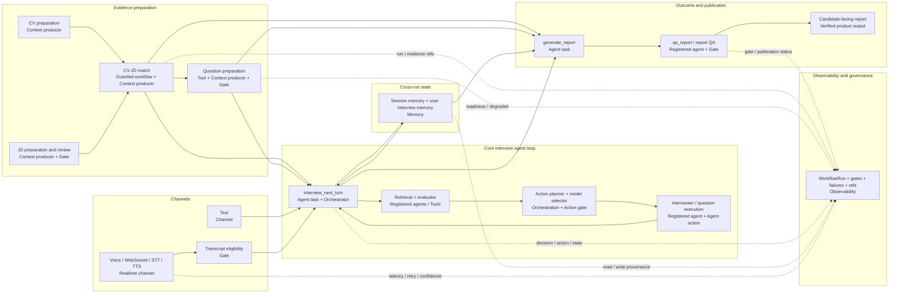

# Product Harness Boundary Map

狀態：target architecture boundary draft，不代表目前 runtime 已實作 shared harness。
日期：2026-07-15

本文件先回答一個比 schema 更早的問題：Kiwi 的 product harness 到底要包住哪些產品流程，每一段在架構裡是 agent、tool、context producer、gate、memory、channel，還是 observability。

結論：harness 必須涵蓋 CV/JD、match、question preparation、interview、memory、report、QA 和 voice，但不能把每個使用模型的 component 都定義成 agent。產品控制器仍是 source of truth；harness 提供 shared contract、policy、gate、trace 和 replay boundary。

相關文件：[共享 Contract Spine](product-harness-contract-spine.md)、[Contract Pressure Tests](product-harness-contract-pressure-tests.md)、[Pre-Harness Readiness Audit](../references/pre-harness-readiness-audit.md)、[Product Agent Harness Upgrade Guide Plan](agent-harness-architecture-upgrade-plan.md)。

---

## Overview

這張 map 是 shared harness 的產品邊界基準：先把每個 workflow surface 分類，再決定哪些地方需要 contract、gate、trace 或 memory policy。它不改變 current runtime ownership。

## Requirements

- CV-JD、question、interview、memory、report、QA、voice 必須使用同一套 boundary vocabulary。
- 每個 surface 必須標出主要分類、current source of truth、harness 責任與禁止的抽象。
- Voice 必須作為 interview channel；memory 必須作為 cross-run state layer。
- Target `WorkflowRun` 邊界不得被誤寫成 current implementation。

---

## 1. 分類規則

| 類型 | 判定標準 | 不代表什麼 |
| --- | --- | --- |
| Agent / agent task | 有明確 objective，會根據 bounded context 做評估、選擇或生成，且輸出會影響產品流程。 | 不是自由自治；仍受 task/action/gate 約束。 |
| Tool / specialist service | 接受明確 input，執行一項能力並回傳 output，沒有自己的產品級 task ownership。 | 使用 LLM 不會自動讓它成為 product agent。 |
| Context producer | 產生下游可引用、可版本化、可追溯的 evidence/artifact。 | 不應直接決定下游 action 或 scoring。 |
| Gate | 對 action、scoring、publication、memory write 或 human review 給出 pass/warn/block/review/degrade。 | 不是一般 validation error；它具有產品控制語義。 |
| Memory | 保存跨 step 或跨 run 的 derived state，必須有 provenance、reader/writer 和 scoring policy。 | 不是另一個 agent，也不是任意聊天紀錄。 |
| Channel | 傳輸使用者輸入和產品輸出，帶 transport、latency、retry、confidence 等限制。 | 不等於核心 decision loop。 |
| Observability | 記錄 run、decision、gate、failure、latency 和 side-effect refs。 | 不取得產品決策權。 |

同一個 component 可以有次要角色。例如 report QA 是 registered agent callable，同時也是 publication gate 的 current adapter source。但每個 component 必須有一個主要 owner，避免責任重疊。

---

## 2. 跨產品 Workflow Map

使用者提出的 `CV-JD -> question -> interview -> memory -> report -> QA -> voice` 是完整範圍，不是實際線性順序。Voice 是 interview 的 channel；memory 在 interview/report 周邊被讀寫；QA 才是 report 後的 publication gate。



---

## 3. Product Surface Classification

| Product surface | 主要分類 | Current source of truth | Harness 責任 | 不應做的抽象 |
| --- | --- | --- | --- | --- |
| CV parsing/preparation | Context producer | CV services、persisted CV profile/evidence profile | 保存 artifact ref、version、owner、source trace、trust metadata。 | 不因 parser/critic 使用模型就建立獨立 product agent。 |
| JD parsing/review | Context producer + Gate | guarded JD flow、persisted Role-Fit review | 保存 `jdFingerprint`、review version/status、trust level；未 verified 時 block match。 | 不把 user-supplied JD 當 system instruction。 |
| CV-JD match | Guarded workflow + Context producer | [CV analysis service](../../backend/src/services/cv/cvAnalysisService.js)、[analyze controller](../../backend/src/controllers/analyzeController.js) | 建 `cv_jd_match` run，記錄 CV/JD lineage、match artifact、Role Evidence Map、degraded/failure。 | 不必先放進 `agentRegistry`；它目前不是 `runTask` task。 |
| Match artifact persistence | Tool / side effect | [match analysis record service](../../backend/src/services/cv/matchAnalysisRecordService.js) | 記錄 side-effect outcome、artifact/version/ref、retention。 | 不把 DB write 當 agent reasoning。 |
| Question pool preparation | Tool + Context producer + Gate | [question pool preparation](../../backend/src/services/questions/questionPoolPreparationService.js) | 記錄 source goals、question refs、readiness、degraded reason、model reserve boundary。 | 不把 prepared question 當已問問題；不讓 evidence hints 進 live payload。 |
| Interview next turn | Agent task + Orchestrator | [master AI service](../../backend/src/services/masterAiService.js) | 每 turn 建 run，綁定 context、candidate actions、selected/fallback action、question/state side effects。 | 不建立第二套 controller 取代現有 `runTask`。 |
| Retrieval | Registered agent / Tool | [agent registry](../../backend/src/services/agentRegistryService.js)、retrieval agent | 記錄 query purpose、source policy、quality、retry、result refs。 | 不把低品質 retrieval 當強 evidence。 |
| Interview evaluator | Registered agent / Tool | agent registry、interview evaluator | 記錄 evaluation output/version，作 planning signal，不直接執行下一題。 | 不讓 evaluator 繞過 planner/action boundary。 |
| Action planner/model selector | Orchestration + Gate | action planner、model selector、voice decision service | 套 `ActionContract`，驗證 allowed candidate、precondition、fallback、idempotency。 | 不讓 model invent action。 |
| Interviewer/question execution | Registered agent + Agent action | interviewer agent、action executor | 產生可追蹤 question output，保存 count/novelty/parent/source metadata。 | 不讓 repair/confirmation 被算成正式題。 |
| Session `agentMemory` | Memory | [agent memory service](../../backend/src/services/aiControl/agentMemoryService.js) | 記錄 source run/evidence、writer/readers、planning/scoring boundary。 | 不把 mixed legacy memory 當 harness-ready memory。 |
| Current `UserCoachingMemory` | Memory adapter source | [user coaching memory service](../../backend/src/services/aiControl/userCoachingMemoryService.js) | 保持 current bounded coaching scope，adapter 成有 provenance 的 user-memory input。 | 不宣稱 current runtime 已是完整 progress-learning profile。 |
| Target user interview learning memory | User-scoped cross-session memory | 尚未實作；由多次 interview run evidence 聚合 | 讓 planner 按 role/competency/question family 避免例行重問、提高問題深度或轉向 coverage gap；預設 `canAffectScoring=false`。 | 不把單次好回答永久升級為 mastered；不讓 evaluator 把歷史 memory 當本輪答案。 |
| Report generation | Agent task | `runTask(generate_report)`、report generator | 綁定 report evidence、claim refs、QA/repair spans、result version。 | 不把 draft 直接當 publishable output。 |
| Report QA | Registered agent + Gate | [report QA agent](../../backend/src/services/agents/reportQaAgent.js) | 將 flags/checks adapter 成 `GateResult`，分開 quality、publication、task lifecycle。 | QA failed 不等於 task execution failed；QA-only 不應默默 rewrite。 |
| Text interview | Channel | HTTP interview controllers | 傳遞 user turn，綁定 client/request/turn id。 | 不另建 text agent。 |
| Voice interview | Realtime channel + channel gate | voice socket、duplex coordinator、confidence/review policy | 綁定 transcript eligibility、confirmation、retry、latency、audio refs 到 interview run。 | Voice 不是 QA 後的 workflow；不在 hot path 加 heavy harness。 |
| Decision/trajectory/trace | Observability | `decisionRecords`、`trajectoryRecords`、`agentTraceEvents` | adapter 到 shared run、gate、failure、side-effect refs。 | 不保存 raw chain-of-thought，不取得決策權。 |

---

## 4. WorkflowRun Boundary

第一版以「最小可獨立判斷成功、失敗、降級或等待的產品 task」作為 `WorkflowRun` 邊界。

| WorkflowRun type | Current entry | Run boundary decision | Parent/grouping |
| --- | --- | --- | --- |
| `cv_jd_match` | `matchCV` -> `runCvJdMatchAnalysis` | 從 verified input 載入開始，到 match artifact 成功保存或 fail/degrade。 | 可由 preparation episode/group id 聚合。 |
| `prepare_question_pool` | `prepareInterviewQuestionPool` | 從載入 match/proof context，到 pool items + readiness/degraded reason。 | Child of session preparation；目前不是 `runTask` task。 |
| `interview_next_turn` | `runTask` | 一個 candidate answer 導致一次 evaluate/plan/action/question/state change。 | Group under `sessionId`；text/voice 由 `channel` 區分。 |
| `generate_report` | `runTask` | 從 report context/retrieval 到 draft、QA、repair、persist。 | Group under completed interview session。 |
| `qa_report` | `runTask` | 對既有 report 作一次 recheck，輸出 gate/publication recommendation。 | Child run of report artifact/version。 |

V0 不把 voice transport event 建成獨立 product `WorkflowRun`。`speech_end`、STT final、confirmation、first audio 是 interview run 的 channel events/spans；若 confirmation 要跨 request resume，建議使用同一 run 的 `waiting -> running`，並保留 `clientTurnId` / transcript refs。這是待 replay 驗證的 V0 default，不是已確認的 runtime 行為。

V0 也不把 memory write 當獨立 agent run。Memory write 必須引用來源 `WorkflowRun`；只有未來真正獨立排程、可重試、可取消的 memory consolidation job，才需要 child run。

---

## 5. Authority Boundary

由高到低的控制權如下：

1. Product safety、auth、ownership、privacy、retention policy。
2. Domain controller 和 current product state machine。
3. `TaskContract` / `ActionContract` / gate policy。
4. Rule planner 和 deterministic guards。
5. Bounded model selection/generation。
6. Candidate-facing wording。

Model output 不得覆蓋前四層。Harness V0 先 observe current behavior，不反轉這個 authority order。

---

## 6. Approved Product Decisions and Pending Decisions

產品 owner 已核准：

- Product harness 覆蓋全部產品流程，但 AgentProfile 只給有 task/decision ownership 的 component。
- CV/JD match 和 question preparation 是 harness workflow/context producer，不因使用模型自動變 agent。
- `interview_next_turn` 是核心 agent loop。
- Target memory 是 user-scoped、cross-session interview learning layer；write 必須綁來源 run/evidence，可影響 question planning/selection/depth；V0 `canAffectScoring=false`。
- Voice 是 interview channel，不是 report/QA 後續步驟；immediate transcript confirmation 採 same-run resume，失效或不可恢復才用 child run。
- Report QA 是 registered agent callable，也是 publication gate adapter source；QA-only 不 silent rewrite，blocking result 進 `needs_review`，repair 使用 explicit action/child run。
- Candidate-sensitive context 優先 refs/hash/version，只在必要時保存 redacted snapshot；source delete 需 delete/recompute/redact derived content，只留無內容 audit tombstone。
- Full run/span/gate/failure timeline 只給 developer；一般使用者只看重要、非技術性的 progress、evidence 和下一步摘要。
- Authority order 採 `policy/safety > controller > contract/gate > deterministic rule > model > wording`。
- Rollout 採全產品 shared target；`interview_next_turn` shadow/observe first，report QA 是第一個候選 enforce slice。

進 runtime 前仍需決定：

- `prepare_question_pool` 是否正式加入 shared task registry，或只由 adapter 產生 `TaskContract` view。
- `WorkflowRun` V0 是 derived read model、append-only artifact，還是獨立 collection。
- background job 晚到時，如何安全綁定原 run/span。
- 哪些 replay case 符合必要性，允許保存 redacted snapshot，以及 developer trace 的 retention window。
- User memory 需要多少獨立 session/evidence、什麼 freshness/revalidation policy，才可停止例行重問或提高深度。
- Gate 進 enforce 的 false-block/latency/human-review threshold。

已核准但仍需要 runtime 測試：same-run voice resume、source deletion propagation、user-memory promotion/suppression、report QA shadow parity。

---

## BDD Scenarios

```gherkin
Scenario: Product surface is classified before harness implementation
  Given a CV-JD, question, interview, memory, report, QA, or voice surface
  When its harness boundary is proposed
  Then it has one primary classification and one current source-of-truth owner
  And its contract, gate, trace, or memory responsibility is explicit
  And target behavior is not represented as current runtime behavior

Scenario: Voice and memory do not become false linear workflow steps
  Given the end-to-end product workflow
  When the boundary map is reviewed
  Then voice is attached to interview as a channel
  And memory is attached to source runs as cross-run state
  And report QA remains the report publication gate
```

## Verification

- 每個 product surface 都出現在 map 或 classification table。
- 每個 surface 都有 current owner 與 target harness responsibility。
- 四個 pressure-test case 可引用同一組 boundary role，不需另建 feature-specific harness。

---

## 7. Evidence Anchors

- Current CV/JD 和 question flow：[CV/JD preparation](../../repo-docs/modules/feature-cv-jd-preparation.md)、[Match 與問題準備](../../repo-docs/modules/feature-match-and-question-prep.md)。
- Current interview control：[訪談控制機制](../../repo-docs/modules/feature-interview-control.md)、[Agent registry 與 task runner](../../repo-docs/modules/agent-registry-and-task-runner.md)。
- Current memory/trace：[Agent memory 與 trace](../../repo-docs/modules/agent-memory-and-trace.md)。
- Current report/QA：[Report generation 與 QA](../../repo-docs/modules/feature-report-and-qa.md)。
- Current voice：[Voice interview](../../repo-docs/modules/feature-voice-interview.md)、[Voice product contract](../../VOICE_INTERVIEW_PRODUCT_BEHAVIOR.md)。

Evidence status：current-state 分類基於上述 source/repo-docs；`WorkflowRun`、shared contract 與 authority 規則是 target design，尚未進 runtime。
