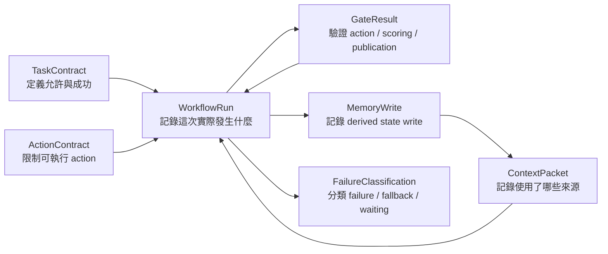

# Product Harness Contract Spine

狀態：target V0 contract draft，不代表目前 runtime 已有這些 schema 或 enforcement。
日期：2026-07-15

本文件定義 Kiwi product harness 的最小共同語言。它不只服務 report，也必須能描述 CV-JD match、question preparation、interview next turn、memory write、report QA 和 voice channel constraints。

V0 只保留七個頂層 contract：`WorkflowRun`、`TaskContract`、`ContextPacket`、`ActionContract`、`GateResult`、`MemoryWrite`、`FailureClassification`。`ExecutionSpan` 和 `AgentEvent` 先作為 `WorkflowRun` 的 nested/ref types，不在 V0 另建平級 contract family。

相關文件：[Harness Boundary Map](product-harness-boundary-map.md)、[Contract Pressure Tests](product-harness-contract-pressure-tests.md)、[Pre-Harness Task Contracts](../references/pre-harness-task-contracts.md)、[Pre-Harness Action Contracts](../references/pre-harness-action-contracts.md)、[Pre-Harness Memory Policy](../references/pre-harness-memory-policy.md)。

---

## Overview

Contract spine 是所有 product workflow 的最小 interoperability layer。它只規範共同的 identity、context、action、gate、memory、failure 與 run semantics；feature-specific payload 仍由 domain schema 擁有。

## Requirements

- 七個頂層 contract 必須能同時表達 agent task 與 guarded product workflow。
- Current controller/state machine 必須保持 source of truth，V0 只允許 shadow/observe adapter。
- Contract 必須分離 lifecycle、quality、publication 與 human-review semantics。
- Private candidate data 預設只保存 refs/hash/version，不複製 raw payload。
- Memory write 必須有 provenance、policy version 與 scoring authority。

---

## 1. Contract Spine 要解決什麼

Goal：

- 讓不同 workflow 使用同一套 run、context、action、gate、memory、failure 語言。
- 讓 current controller/service 保持 source of truth，harness 先做 shadow/observe adapter。
- 讓新 feature 可以被 trace、replay、比較和 rollback，而不是只加 `console.log`。
- 讓 quality、publication、task lifecycle、human review 不再混成一個 status。

Non-goals：

- 不把所有 service 變成 agent。
- 不建立第二套 orchestration engine。
- 不立即修改 Mongo schema 或新增 collection。
- 不保存 raw chain-of-thought。
- 不允許 memory 在沒有 policy/provenance 時直接影響 scoring。
- 不用一套 contract 取代 CV/JD、question、voice、report 的 domain schema。

Risk class：High。這些 contract 將來可能控制 question、scoring eligibility、memory、publication 和 human review；V0 必須先 shadow/observe，再分 gate 進 warn/enforce。

---

## 2. Contract 關係



Authority order：product safety/ownership/privacy > domain controller/state machine > task/action/gate contract > deterministic planner/guards > model output > wording。Contract 不能降低上層 authority。

---

## 3. 共用 Primitive

所有 contract 都使用相同 reference 和 version 規則：

```yaml
ContractRef:
  type: string
  id: string
  version: string

ArtifactRef:
  artifactType: string
  artifactId: string
  artifactVersion: string | number | null
  ownerScope: user | session | system
  ownerId: string
  contentHash: string | null
  sensitivity: public | internal | private_candidate_data
  retentionClass: string

ExecutionMode:
  value: shadow | observe | warn | enforce
```

規則：

- ID 在同一環境內唯一且 immutable。
- Contract version 一旦被 run 引用，不可就地改語義。
- Artifact ref 優先保存 ID/version/hash，不預設複製 CV、JD、transcript、memory 或 report raw payload。
- Candidate-sensitive payload 需要 redacted reference；internal debug 不等於可以保存所有內容。

---

## 4. `WorkflowRun`

`WorkflowRun` 是一次可獨立判斷 lifecycle、quality、publication 或 waiting 狀態的產品 task。它可以描述 agent task，也可以描述非 agent 的 guarded workflow，例如 `cv_jd_match`。

```yaml
WorkflowRun:
  schemaVersion: workflow_run_v0
  workflowRunId: string
  episodeId: string | null
  parentWorkflowRunId: string | null
  taskType: cv_jd_match | prepare_question_pool | interview_next_turn | generate_report | qa_report
  taskContractRef: ContractRef
  executionMode: shadow | observe | warn | enforce
  channel: text | voice | system | batch
  ownerUserId: string
  sessionId: string | null
  clientTurnId: string | null
  startedAt: ISO-8601
  endedAt: ISO-8601 | null
  lifecycleStatus: queued | running | waiting | completed | failed | cancelled
  qualityStatus: unverified | passed | warn | degraded | blocked | needs_review
  publicationStatus: not_applicable | draft | ready | ready_after_repair | needs_review | rejected | published
  stateBeforeRef: ArtifactRef | null
  stateAfterRef: ArtifactRef | null
  contextPacketRefs: [ContractRef]
  selectedActionRef: ContractRef | null
  gateResultRefs: [ContractRef]
  memoryWriteRefs: [ContractRef]
  failureRefs: [ContractRef]
  resultRefs: [ArtifactRef]
  spanRefs: [ContractRef]
  eventRefs: [ContractRef]
  sideEffects:
    - operation: string
      targetRef: ArtifactRef | null
      status: pending | completed | failed | skipped
      idempotencyKey: string | null
```

Invariants：

- `lifecycleStatus=completed` 不等於 `qualityStatus=passed`，也不等於 report 可發布。
- `qa_report` 可以 execution completed，但 `publicationStatus=needs_review`。
- `interview_next_turn` 必須能指出 state before/after、selected/fallback action 和 question side effect。
- Background event/write 必須回綁 `workflowRunId`；綁不上時是 observability gap，不能靜默丟棄。
- Voice confirmation 可讓同一 run 進 `waiting`，確認後 resume；V0 不因 channel 切出另一套 workflow schema。

---

## 5. `TaskContract`

`TaskContract` 定義一類 task 可以做什麼、何時成功、何時停止。它適用於 agent task 和非 agent product workflow；是否是 agent 由 boundary map 決定，不由 `TaskContract` 決定。

```yaml
TaskContract:
  schemaVersion: task_contract_v0
  taskContractId: string
  taskType: string
  contractVersion: string
  ownerComponent: string
  objective: string
  appliesTo:
    workflowKind: agent_task | guarded_workflow | preparation_workflow
    allowedChannels: [text | voice | system | batch]
  requiredContextTypes: [string]
  optionalContextTypes: [string]
  allowedAgentRefs: [string]
  allowedToolRefs: [string]
  allowedActionTypes: [string]
  successCriteria: [string]
  stopConditions: [string]
  forbiddenBehaviors: [string]
  sideEffectPolicy:
    allowedTargets: [string]
    requiredIdempotencyScopes: [string]
    bestEffortOperations: [string]
  requiredGateTypes: [string]
  failurePolicy:
    allowedFallbacks: [string]
    failClosedReasons: [string]
  defaultExecutionMode: shadow | observe | warn | enforce
```

Invariants：

- Success criteria 必須描述產品結果，不可只寫「model returned text」。
- Forbidden behavior 必須包含不得覆蓋 ownership/privacy/time/question/scoring/publication boundary。
- Best-effort side effect 失敗可以讓 run completed + degraded，但必須留下 failure classification。
- `qa_report` 是 recheck/gate task；除非另有 repair contract，不得默默 rewrite。

---

## 6. `ContextPacket`

`ContextPacket` 記錄一次 run 實際使用的 context lineage。它是 immutable view；不是另一份 domain database，也不是把所有 raw payload 複製一次。

```yaml
ContextPacket:
  schemaVersion: context_packet_v0
  contextPacketId: string
  contractVersion: string
  workflowRunId: string
  taskType: string
  purpose: string
  assembledAt: ISO-8601
  assemblerComponent: string
  sources:
    - sourceType: cv_profile | jd_profile | match_analysis | role_evidence_map | question_pool | transcript | session_state | session_memory | user_coaching_memory | user_interview_memory | retrieval_result | report
      artifactRef: ArtifactRef
      reviewStatus: unreviewed | edited | verified | system_derived | not_applicable
      trustLevel: user_supplied | human_reviewed | system_derived | provider_derived
      instructionUseAllowed: false
      evidenceRefs: [ArtifactRef]
  activeEvidenceRefs: [ArtifactRef]
  droppedContext:
    - sourceRef: ArtifactRef
      reasonCode: string
  redactionPolicyVersion: string
```

Invariants：

- CV、JD、transcript、candidate answer 都是 data，`instructionUseAllowed=false`。
- CV-JD match 必須保留 CV owner/ref、JD fingerprint/review version、match artifact/version。
- Question/interview/report 使用的 evidence 必須能回到 source artifact，不能只保存自然語言 summary。
- Current user coaching memory 和 target user interview memory 都不能因被放入 packet 就取得 scoring authority。
- User interview memory 可以進 question-planning packet，影響 coverage、question family 和 depth；evaluator scoring packet 預設不得包含它作為本輪 answer evidence。
- User interview memory 必須帶 role/competency/question-family applicability、source evidence 與 freshness；mismatched/stale/conflicting memory 不得 suppress question。
- Stale/unowned/unverified context 不得進入需要 verified evidence 的 task；應 block、review 或 degrade。

---

## 7. `ActionContract`

`ActionContract` 管理 agent 可選 action 或高風險 side-effectful action。純 deterministic computation 不必被硬包成 action；它可以是 run span。V0 優先 cover interview action、report generation action 和會產生 user-visible state change 的操作。

```yaml
ActionContract:
  schemaVersion: action_contract_v0
  actionContractId: string
  actionType: string
  contractVersion: string
  allowedTaskTypes: [string]
  allowedCallerRefs: [string]
  riskClass: low | medium | high
  preconditions: [string]
  requiredInputRefs: [string]
  forbiddenBehaviors: [string]
  postconditions: [string]
  sideEffects:
    allowedTargets: [string]
    requiresAuditRef: boolean
  idempotency:
    required: boolean
    scope: none | workflow_run | session_turn | client_turn | artifact_version
  deadlineMs: number | null
  retryPolicy:
    maxAttempts: number
    retryableReasons: [string]
  fallbackPolicy:
    fallbackActionType: string | null
    failClosed: boolean
  requiredGateTypes: [string]
```

Invariants：

- Model-selected action 必須存在於 candidate/allowed set。
- Invalid/disallowed/model error 應回 bounded fallback，並產生 gate/failure evidence。
- Repair、confirmation、system turn 不得藉 action output 變成 countable interview question。
- Side effect retry 必須有 idempotency scope；voice/client duplicate event 不得產生雙題。
- `ActionContract` 不用來包裝每個 helper function。

---

## 8. `GateResult`

`GateResult` 是可查詢、可 replay 的控制判斷。Gate 可以先 observe，不代表第一版就 block。

```yaml
GateResult:
  schemaVersion: gate_result_v0
  gateResultId: string
  workflowRunId: string
  gateType: string
  gatePolicyVersion: string
  executionMode: shadow | observe | warn | enforce
  evaluatedAt: ISO-8601
  evaluatorRef: string
  subjectRef: ContractRef | ArtifactRef
  status: pass | warn | block | review | degrade
  reasonCodes: [string]
  evidenceRefs: [ArtifactRef]
  blockingScope: none | action | task | scoring | memory_write | publication
  humanReadableSummary: string
  nextStep:
    type: continue | fallback | retry | wait_for_review | reject | publish
    ref: string | null
  humanReviewRef: ContractRef | null
```

Invariants：

- `block` 必須指定 `blockingScope`；不能用模糊 failed status 讓所有下游都停。
- Gate evidence 不可只有 model self-report。
- `review` 需要 resume/continuation semantics。
- Report QA flags、question novelty/counting、allowed action、transcript eligibility、memory policy 都用同一 status vocabulary，但保留不同 gate type/reason code。
- Candidate-facing summary 必須 redacted，不暴露 internal ranking、raw trace 或 chain-of-thought。

---

## 9. `MemoryWrite`

`MemoryWrite` 是 proposed/committed derived-state write 的 audit envelope。它不是 memory value 本身，也不是新的自主 memory agent。

```yaml
MemoryWrite:
  schemaVersion: memory_write_v0
  memoryWriteId: string
  workflowRunId: string
  sourceTaskType: string
  sourceTurnId: string | null
  sourceEvidenceRefs: [ArtifactRef]
  writerRef: string
  scope: session | user_coaching | user_interview
  memoryType: topic_history | evidence_gap | project_usage | strategy_outcome | reflection_lesson | coaching_summary | competency_signal | question_exposure | answer_strength | depth_progression | coverage_priority | revalidation_due
  operation: propose | upsert | delete | redact | tombstone
  valueRef: ArtifactRef | null
  redactedSummary: string | null
  status: proposed | committed | rejected | deleted | tombstoned
  policyVersion: string
  policy:
    allowedReaders: [string]
    canAffectPlanning: boolean
    canAffectQuestionSelection: boolean
    canAffectQuestionDepth: boolean
    canSuppressRoutineRepeat: boolean
    canAffectScoring: boolean
    candidateVisible: boolean
    retentionClass: string
    sourceDeletePolicy: delete | recompute | redact | tombstone_metadata
  gateResultRef: ContractRef
  createdAt: ISO-8601
```

Invariants：

- 沒有 `workflowRunId` 和 source evidence 的 write 不可進 harness memory plane。
- Session signal 不得在沒有 promotion gate 時自動升級成 user-level memory。
- User-level interview memory 可以影響 planning、question selection/depth 和 routine-repeat suppression；V0 contract 固定 `canAffectScoring=false`。
- Routine-repeat suppression 必須通過跨獨立 session evidence、applicability、freshness 和 conflict/revalidation gate；不能由單次好回答永久觸發。
- 所有 memory read 必須在 purpose-specific ContextPacket 中可見；planner 和 evaluator 不得共用沒有用途邊界的 memory view。
- Candidate-visible memory 只能使用 allowlisted/redacted progress 或 coaching summary；full memory/write trace 僅供 developer audit。
- Source delete/retention 必須能找到每個 contribution；derived memory 需 delete/recompute/redact，只能保留不含內容的 tombstone metadata。

---

## 10. `FailureClassification`

`FailureClassification` 解釋一個 run/span/action/gate 為什麼失敗、降級、fallback 或等待。它不能把所有非理想結果都叫 exception。

```yaml
FailureClassification:
  schemaVersion: failure_classification_v0
  failureId: string
  workflowRunId: string
  subjectRef: ContractRef | ArtifactRef | null
  occurredAt: ISO-8601
  stage: string
  category: context_failure | retrieval_failure | model_output_failure | action_policy_failure | tool_or_side_effect_failure | verification_failure | memory_policy_failure | latency_failure | human_review_waiting | environment_failure
  reasonCode: string
  handled: boolean
  expected: boolean
  retryable: boolean
  retryAfterMs: number | null
  fallbackApplied: boolean
  fallbackRef: ContractRef | null
  userImpact: none | delayed | degraded_output | action_blocked | scoring_blocked | publication_blocked
  humanReviewRequired: boolean
  redactedErrorRef: ArtifactRef | null
```

Invariants：

- QA blocked 和 task execution failed 必須分開。
- Human review waiting 是 lifecycle/control state，不應自動算 system failure。
- Bounded model fallback 可以是成功路徑；仍需記錄 model failure signal，但 `handled=true`。
- Best-effort question-filter/background trace write 失敗不應靜默，也不必一定讓主 task failed。
- Local sandbox/provider/environment failure 不得被誤算成 candidate/product quality failure。

---

## 11. Execution Mode

| Mode | Contract 行為 | Product output |
| --- | --- | --- |
| `shadow` | 只建立 derived contract view，不能改 current control flow。 | 完全由 legacy runtime 決定。 |
| `observe` | 記錄 compliance、gate、failure；不改結果。 | 完全由 legacy runtime 決定。 |
| `warn` | 留下 warning，可進 developer/review UI；仍不自動 block。 | 保留 legacy fallback/output。 |
| `enforce` | 已通過 replay/baseline 的高風險 rule 可 block/fallback/review。 | 由 domain controller執行明確 next step。 |

Contract 自身不執行 side effect。Enforcement adapter 必須回到現有 domain controller，由 controller 決定 fallback、wait、reject 或 publish。

---

## 12. Versioning and Ownership

| Contract | Owner | V0 source adapter | Version rule |
| --- | --- | --- | --- |
| `WorkflowRun` | shared harness kernel | controller invocation + decision/trajectory/trace/artifacts | run 固定引用 contract versions。 |
| `TaskContract` | workflow owner | current source + pre-harness task docs | 語義變更升 contract version。 |
| `ContextPacket` | context/memory plane | session analysis、match artifact、retrieval bundle | source artifact version/hash 必須保留。 |
| `ActionContract` | action/control owner | action enum、planner candidates、executor metadata | action pre/postcondition 變更升版。 |
| `GateResult` | gate policy owner | report QA、question/voice/retrieval guards | policy/reason semantics 變更升版。 |
| `MemoryWrite` | memory policy owner | session memory/reflection/coaching memory adapters | policy version與 write 一起保存。 |
| `FailureClassification` | observability/governance owner | current error/degraded/fallback signals | reason code 不重用不同語義。 |

---

## 13. V0 Acceptance

這套 spine 只有在以下條件成立時才可以進 runtime adapter：

1. 四個代表 case 都能只用這七個 contract 表達，沒有 workflow-specific top-level schema 逃逸。
2. CV/JD review lineage、question action/state change、memory provenance/scoring、report publication 都有明確 owner。
3. `lifecycleStatus`、`qualityStatus`、`publicationStatus` 不混用。
4. Voice 能以 channel constraints 接入 interview run，不需要複製一套 contract。
5. Current source truth 和 target contract field 有 adapter mapping；無證據欄位標為 target/unknown。
6. 所有 contract 都有 shadow/observe rollback boundary。
7. Replay fixture 能對 input、expected action/gate/memory/failure/output refs 作 assertions。

Pressure-test 結果與 unresolved decisions 見 [Product Harness Contract Pressure Tests](product-harness-contract-pressure-tests.md)。

## BDD Scenarios

```gherkin
Scenario: A workflow uses the shared contract spine without replacing domain schemas
  Given a versioned TaskContract and domain-owned input artifacts
  When a workflow executes in shadow or observe mode
  Then WorkflowRun references its ContextPacket, selected ActionContract, GateResult, MemoryWrite, and FailureClassification as applicable
  And feature-specific payload remains behind versioned ArtifactRef values
  And the current domain controller remains authoritative

Scenario: Completed execution does not imply publishable output
  Given a qa_report run that completes its verification logic
  When a publication-blocking GateResult is produced
  Then lifecycleStatus is completed
  And qualityStatus is blocked or needs_review
  And publicationStatus is needs_review or rejected
```

## Verification

- 四個代表 case 都能只使用七個頂層 contract 表達。
- 每個 contract 都有 identity、version、owner、invariant 與 execution-mode boundary。
- Shared contract 不複製 feature domain schema，也不取得 controller authority。
- Pressure-test coverage matrix 沒有要求新增 report-specific、voice-specific 或 memory-specific run schema。

Evidence status：本頁是 target contract design。Current-state adapter assumptions來自 pre-harness audit 和 current source；沒有任何欄位可視為已部署 runtime schema。
