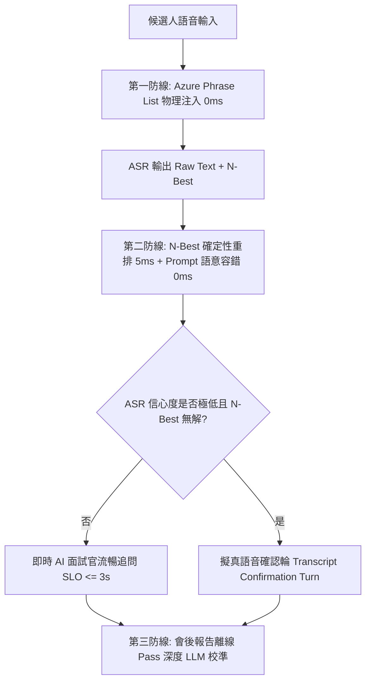

# 語音面試轉寫校準與精準度優化計畫

本文件分析了 Kiwi AI Interview Agent 當前的語音轉文字（STT / ASR）架構、與業界先進方案的對比差距，並提出了未來引入語音校準與 ASR 二次文本糾錯的優化計畫。

---

## 1. 系統現狀分析 (Current Architecture)

目前 Kiwi AI Interview Agent 在語音面試轉寫的處理流程如下：

```text
[候選人發音] 
   │
   ▼ (前端麥克風採集 - 啟用瀏覽器級 DSP: EchoCancellation, NoiseSuppression, AutoGainControl)
[16kHz PCM 音訊串流] 
   │
   ▼ (透過 WebSocket 發送至後端)
[Azure Speech SDK 連線] ── (載入 speechPhraseHintService 生產的 Phrase List)
   │
   ▼ (Azure ASR 轉寫輸出 Raw Text)
[transcriptNormalizer 靜態修正] ── (比對 transcriptReplacements 的靜態正則表達式)
   │
   ▼
[speechConfidenceGate 置信度檢查] ── (低於閾值觸發 Repair Prompt 引導；高於則通過)
   │
   ▼
[送入 LLM 進行評估 / 生成下一題]
```

### 當前的校準與修正機制：
1.  **聲學前端採集 (Acoustic Constraints)**：
    前端 `MICROPHONE_AUDIO_CONSTRAINTS` 顯式開啟了瀏覽器內建的回音消除、降噪與自動增益：
    ```javascript
    echoCancellation: true,
    noiseSuppression: true,
    autoGainControl: true
    ```
2.  **動態熱詞偏置 (Dynamic Phrase Hints)**：
    `speechPhraseHintService.js` 在連線前，從候選人 CV、職位 JD 與面試計畫中，動態提取所有技術名詞、公司名稱及候選人名字，並將其注入 Azure `PhraseListGrammar` 中，並設置偏置權重為 `1.5`。這大幅提升了專有名詞的第一階段辨識率。
3.  **靜態規則修正 (Regex Normalization)**：
    轉寫完成後，`transcriptNormalizer.js` 讀取 `transcriptReplacements.js` 的配置，利用正則表達式進行拼寫替換（如將常見的 `post gray sql` 修正為 `PostgreSQL`，`proper engineering` 修正為 `prompt engineering`）。

---

## 2. 與業界先進技術對比與 Gap 分析

| 技術維度 | 業界/開源標竿作法 (如 Zoom, Microsoft FastCorrect) | Kiwi 系統現狀 | 具體 Gap 與最佳實踐 |
| :--- | :--- | :--- | :--- |
| **第一階段：熱詞偏置 (0ms)** | 支援動態熱詞權重分配與大規模用戶詞典（1,000 詞以上）。 | 已實作 `speechPhraseHintService` 動態抓取 CV/JD 名詞注入 Azure PhraseList。 | 已有良好基線，可進一步優化熱詞權重分級與動態加權。 |
| **第二階段：N-Best 假說篩選 (5ms)** | 讀取 ASR 輸出的多路假說（N-Best 候補），以純 Code / 小模型做語意重排。 | 目前只讀取 `NBest[0]`，其餘候補丟棄。 | **N-Best 利用率為 0**。若 Azure 第一候選詞判斷錯誤（如 `post gray`），但正確答案在第二候選 (`PostgreSQL`)，目前會遺失。 |
| **第三階段：熱路徑語意容錯 (0ms)** | **熱路徑嚴禁呼叫 LLM 轉寫**（避免增加 1s+ 延遲破壞 3s SLO）；利用 Prompt Context 讓面試官理解同音字（如 `tea`=`JWT`）。 | 依賴 `transcriptReplacements.js` 靜態正則。 | 需新增 Evaluator/Planner 的 Prompt Context Tolerance，防止 ASR 同音字造成「語境毒化」與荒謬追問，同時維護 3 秒 SLO。 |
| **第四階段：會後報告離線 Pass (Async)** | 會後背景 Job 調用強大 ASR/LLM 全量重跑，清理口吃贅字 ("uh", "um") 與專有名詞。 | 直接採用即時轉寫文字。 | 需建立會後非同步校準與 Disfluency Cleanup 流程。 |

---

## 3. 未來優化與改善計畫 (Three-Tier Defense Architecture)

基於「保護 ESOL 候選人面試體驗」與「捍衛 3 秒 SLO 語音延遲」的雙重商業與系統需求，我們採用 **「三階防禦縱深 (3-Tier Defense System)」**：



### 改善行動一：熱路徑零延遲 N-Best 確定性重排 (5ms)
1. **提取 N-Best 資料結構**：
   在 `realtimeSpeechSessionService.js` 中，將 `recognizer.recognized` 捕獲的完整 `NBest` 陣列（包含 Display, Confidence 等）提取出來。
2. **熱詞加權比對 (Deterministic Re-ranking)**：
   寫一個輕量級比對函數（5ms 內執行），若 `NBest[0]` 未包含 JD/CV 核心熱詞，但 `NBest[1]` 或 `NBest[2]` 包含了，且信心度差距在容許範圍內（例如小於 0.15），則自動升等 `NBest[1]`，**完全不花 1 毫秒 LLM 延遲**。

### 改善行動二：熱路徑 Prompt 語意容錯 (Context Tolerance) 防止語境毒化 (0ms)
1. **面試官 LLM 寬容引導**：
   在面試官 Evaluator/Planner 的 System Prompt 中加入確定性容錯指令：
   > *"你接收到的回答來自 ASR 語音轉寫。請寬容對待同音異義字或拼寫錯誤（例如將 'JWT' 識別為 'tea'，'RAG' 識別為 'rag'）。請根據 CV/JD 背景上下文理解其真實意圖並進行追問，嚴禁質疑或調侃 ASR 轉寫錯字。"*
2. **防止荒謬追問**：
   此機制防止 ASR 錯字造成「語境毒化」，確保 AI 面試官能問出高品質自適應追問，且不增加任何網路請求延遲。

### 改善行動三：極低置信度下的「擬真語音確認輪」(Transcript Confirmation Turn)
1. **代替破壞沉浸感的 UI 彈窗**：
   當 ASR 信心度極低且 N-Best 無解時，不跳彈窗、不用 LLM 瞎猜，而是觸發擬真語音確認：
   > *"I heard you were explaining your backend auth system with JWT, is that correct?"*
2. **符合產品行為合約**：
   語音確認輪屬於 `transcript_needs_confirmation` 狀態，不計入正式面試題數，既符合紐西蘭職場溝通習慣，又保護了沉浸感。

### 改善行動四：會後報告離線 Pass 深度校準 (Offline Deep Cleanup)
1. **會後背景 Job**：
   面試結束後，在背景工作（Background Job）中使用高精度離線 ASR 模型（如 **Faster-Whisper Large-V3**）對整場音檔進行重跑。
2. **LLM 贅字與同音字修復 (Disfluency Cleanup)**：
   調用 LLM 進行完整校準，去除無意義的口吃/贅字（如 "uh", "um", "you know"），並全篇統一專有名詞拼寫，產出最美觀、精準的最終報告逐字稿。
