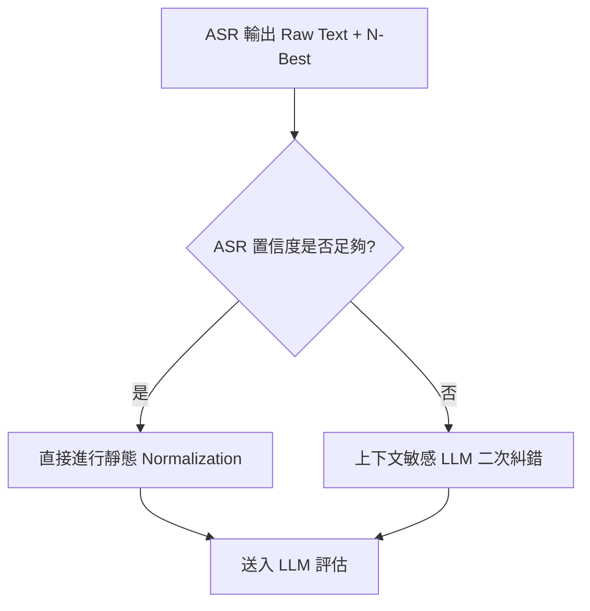

# 語音面試轉寫校準與精準度優化計畫

本文件分析了 Kiwi AI Interview Agent 當前的語音轉文字（STT / ASR）架構、與業界先進方案的對比差距，並提出了未來引入語音校準與 ASR 二次文本糾錯的優化計畫。

---

## 1. 系統現狀分析 (Current Architecture)

目前 Kiwi AI Interview Agent 在語音面試轉寫的處理流程如下：

```text
[候選人發音] 
   │
   ▼ (前端麥克風採集 - 啟用瀏覽器級 DSP: EchoCancellation, NoiseSuppression, AutoGainControl)
[16kHz PCM 音訊串流] 
   │
   ▼ (透過 WebSocket 發送至後端)
[Azure Speech SDK 連線] ── (載入 speechPhraseHintService 生產的 Phrase List)
   │
   ▼ (Azure ASR 轉寫輸出 Raw Text)
[transcriptNormalizer 靜態修正] ── (比對 transcriptReplacements 的靜態正則表達式)
   │
   ▼
[speechConfidenceGate 置信度檢查] ── (低於閾值觸發 Repair Prompt 引導；高於則通過)
   │
   ▼
[送入 LLM 進行評估 / 生成下一題]
```

### 當前的校準與修正機制：
1.  **聲學前端採集 (Acoustic Constraints)**：
    前端 `MICROPHONE_AUDIO_CONSTRAINTS` 顯式開啟了瀏覽器內建的回音消除、降噪與自動增益：
    ```javascript
    echoCancellation: true,
    noiseSuppression: true,
    autoGainControl: true
    ```
2.  **動態熱詞偏置 (Dynamic Phrase Hints)**：
    `speechPhraseHintService.js` 在連線前，從候選人 CV、職位 JD 與面試計畫中，動態提取所有技術名詞、公司名稱及候選人名字，並將其注入 Azure `PhraseListGrammar` 中，並設置偏置權重為 `1.5`。這大幅提升了專有名詞的第一階段辨識率。
3.  **靜態規則修正 (Regex Normalization)**：
    轉寫完成後，`transcriptNormalizer.js` 讀取 `transcriptReplacements.js` 的配置，利用正則表達式進行拼寫替換（如將常見的 `post gray sql` 修正為 `PostgreSQL`，`proper engineering` 修正為 `prompt engineering`）。

---

## 2. 與業界先進技術對比與 Gap 分析

| 技術維度 | 業界/開源標竿作法 (如 Zoom, Microsoft FastCorrect) | Kiwi 系統現狀 | 具體 Gap |
| :--- | :--- | :--- | :--- |
| **第一階段：熱詞偏置** | 支援動態熱詞權重分配與大規模用戶詞典（高達 1,000 詞以上）。 | 目前動態提取熱詞，但受限於 Azure PhraseList 上限（本系統設定最長 120 詞）且權重固定。 | 1. 缺乏針對未匹配的長尾技術詞的動態增長辭典。<br>2. 當前權重設定為單一固定值，無法依重要性分級。 |
| **第二階段：N-Best 假說篩選** | 讀取 ASR 輸出的多路假說（N-Best 候補句子），利用小語言模型做語意重排，選取最合理結果。 | 目前只讀取 `NBest[0]`（Azure 自行判定的最佳結果），完全丟棄了其餘 4 個候選結果。 | 1. **N-Best 利用率為 0**。若 Azure 第一候選詞判斷錯誤，但正確答案在第二候選中，目前系統會直接遺失正確資訊。 |
| **第三階段：LLM 上下文敏感修正** | 將 ASR Raw Text 伴隨 **面試背景上下文（當前提問、JD 核心要求、CV 已知技能）** 送入低延遲 LLM 作語意語境校準。 | 僅依賴 `transcriptReplacements.js` 中靜態正則進行「死板」替換。 | 1. **無法處理動態同音字或未預期的拼寫錯誤**（例如：候選人提到某個冷門框架名，因為沒有寫進靜態替換表，系統就無法修復）。<br>2. 靜態規則維護成本高，難以隨技術演進自動適應。 |

---

## 3. 未來優化與改善計畫 (Future Optimization Plan)

我們規劃在後續演進中，引入以下校準與修正機制，以實現「Grounded & Calibrated Transcript」：



### 改善行動一：善用 Azure ASR N-Best 多路假說重排
1.  **提取 N-Best 資料結構**：
    在 `realtimeSpeechSessionService.js` 中，將 `recognizer.recognized` 捕獲的完整 `NBest` 陣列（包含 Display, Confidence, 以及 Word-level timestamps）提取出來。
2.  **熱詞加權匹配 (Keyword-based Re-ranking)**：
    寫一個輕量級的比對函數，若 `NBest[0]` 沒有包含面試計畫（Interview Plan）的核心要求熱詞，但 `NBest[1]` 或 `NBest[2]` 包含了，且信心度差異在容許範圍內（例如小於 0.15），則自動將該句子的優先順序提升，修正為最終顯示文本。

### 改善行動二：實作上下文敏感之 LLM 即時糾錯 (Context-Aware LLM Calibration)
1.  **引入低延遲糾錯 Agent (Corrective Utility Agent)**：
    在轉寫完成後且 ASR 置信度低於 `0.85` 時，觸發一個極輕量、低延遲的微型 LLM 呼叫（可利用 DeepSeek 的 Caching 或是更小型的本地模型如 Llama 3-8B）。
2.  **提供語境 Context 偏置**：
    將以下 Context 傳入糾錯 Prompt：
    *   **當前問題 (Active Question)**：AI 剛問的內容（因為候選人高概率會回答與此主題相關的單字）。
    *   **JD 關鍵技能與要求**。
    *   **CV 提取的核心技能**。
3.  **防止過度潤飾與幻覺**：
    Prompt 必須設定強烈限制：*「僅修正專有名詞拼寫、拼音錯誤與明顯的文法斷句，絕對禁止修改候選人的答題意圖，若無法確定則保留原樣。」*

### 改善行動三：離線分析報告時的二次精準轉寫 (Offline Deep Transcript Cleanup)
*   對於語音面試過程，為了維護 3 秒的低延遲，我們在面試當下採取「Azure 實時辨識 + 輕量校準」。
*   但面試結束、生成最終報告前，可以在背景工作（Background Job）中，使用高精確度的離線 ASR 模型（如 **Faster-Whisper Large-V3**），對整場面試的原始音檔進行完整轉寫，並利用 LLM 做一次深度校準，將乾淨的、無口吃 filler words（如 "uh", "um"）的逐字稿寫入 Report Dataset，以保證最終評估報告的證據可信度。
