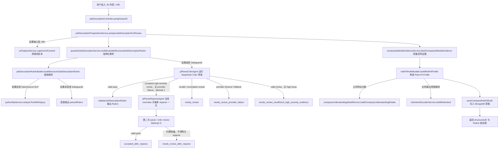
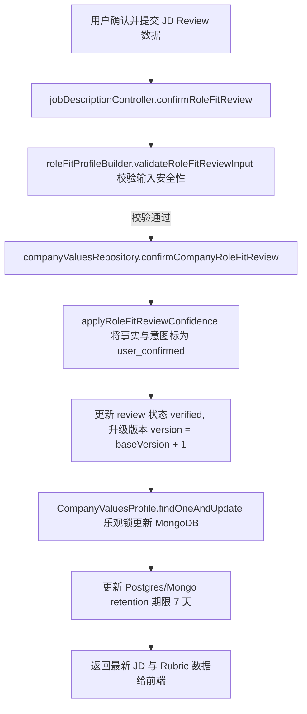

# JD 解析與審核代碼管道 (JD Parsing & Review Code Pipeline)

本文件詳細記錄了用戶貼入 Job Description (JD) 內容或輸入網址後，系統如何進行結構化解析、網頁證據採集、安全防禦 (Safeguards)、解碼角色契合特徵，以及在 Human Review（人工審核）確認後如何寫入資料庫的完整代碼管道。

---

## 1. JD 上傳/網址抓取與解析流程 (JD Paraphrase & Parsing Flow)

當用戶在前端貼入 JD 文字或 URL，並提供 **Company website URL** 或 **Manual company context**（至少提供一項）後，點擊「Summarise JD」，前端會發送請求至後端 API：`POST /api/upload/jd/paraphrase`。該請求由 [jobDescriptionController.js](file:///Users/heminghan/Kiwi-AI-interview-Agent/backend/src/controllers/jobDescriptionController.js) 中的 `paraphraseJD` 處理器接收，具體處理流程如下：

### 1.1 核心步驟解析

1. **獲取與轉換 JD 純文字 (JD Text Retrieval)**：
   - 調用 [jobDescriptionPreparationService.js](file:///Users/heminghan/Kiwi-AI-interview-Agent/backend/src/services/jobDescription/jobDescriptionPreparationService.js)。
   - 若用戶輸入為 HTTP/HTTPS 網址，調用 [urlCaptureService.js](file:///Users/heminghan/Kiwi-AI-interview-Agent/backend/src/services/jobDescription/urlCaptureService.js) 異步抓取該網頁，過濾 HTML 標籤後提取出可見純文字 `visibleText`。
2. **第一階段：結構化 Rubric 解析與 Critic 安全防禦 (Guarded JD Parsing)**：
   - 委託給 [guardedJobDescriptionService.js](file:///Users/heminghan/Kiwi-AI-interview-Agent/backend/src/services/jobDescription/guardedJobDescriptionService.js)。
   - **快取檢查**：優先從記憶體快取 (`memoryCache`) 查找歷史解析結果。
   - **基礎解析**：調用 [jobDescriptionRubricBuilder.js](file:///Users/heminghan/Kiwi-AI-interview-Agent/backend/src/services/jobDescription/jobDescriptionRubricBuilder.js) 提取職位 overview、標題、工作地點、職職要求，並調用 [pythonNlpService.js](file:///Users/heminghan/Kiwi-AI-interview-Agent/backend/src/services/pythonNlpService.js) spaCy 提取名詞片語。同時，若未設定禁用，調用 [jobDescriptionAiService.js](file:///Users/heminghan/Kiwi-AI-interview-Agent/backend/src/services/jobDescription/jobDescriptionAiService.js) AI 服務提取關鍵技術技能。
   - **Critic 安全防禦與 bounded gate (Safeguard Gate)**：若開啟 Safeguards，調用 **DeepSeek Critic Agent** 審查首輪解析是否安全完整。只有 review contract 完整、`verdict=revise`、至少有一個完整 `severity=high` issue、且沒有 provider timeout/fallback 時，首輪 `attempt=1` 才會調用 **DeepSeek Reparse Agent** 產出 override 指令，並最多 reparse 一次。
   - **Gate 結果**：invalid 或 incomplete review 進 `needs_review`（包含 `needs_review_missing_review` 與 `needs_review_invalid_review_contract`）；provider timeout/fallback 進 `needs_review_provider_failure`；valid revise 但沒有 high-severity issue 進 `needs_review_insufficient_high_severity_evidence`。第二次 review（`attempt=2`）不得再次 reparse；若仍需阻擋則進 `needs_review_after_reparse`，valid pass 則保留 `accepted_after_reparse`。Safeguards disabled 時沿用 `buildSkippedSafeguardResult`，不呼叫 gate。
3. **第二階段：公司網站證據採集 (Website Evidence Fetching)**：
   - 調用 [companyWebsiteEvidenceService.js](file:///Users/heminghan/Kiwi-AI-interview-Agent/backend/src/services/jobDescription/companyWebsiteEvidenceService.js) 的 `fetchCompanyWebsiteEvidence`。
   - 對網址進行安全性與公網屬性校驗。探測 base URL 及同源 candidate 路徑（如 `/about`, `/careers`, `/about-us`）。
   - 限制讀取大小 (MAX_BYTES) 且不跟隨重定向，提取文字後切成最多 5 筆量化片段 (`snippets`)。若抓取失敗，降級為 `supplied_url_only` 供後續核對。
4. **第三階段：解碼角色契合剖析模型 (`buildRoleFitProfile`)**：
   - 調用 [roleFitProfileBuilder.js](file:///Users/heminghan/Kiwi-AI-interview-Agent/backend/src/services/jobDescription/roleFitProfileBuilder.js) 融合 Rubric、採集到的公司網頁證據及用戶手動輸入的公司背景。
   - **防禦 prompt 注入**：正則檢測手動背景，過濾清除惡意指令。
   - **衝突檢測**：比對用戶手動背景與網頁 snippets，若手動描述明確否定了網頁關鍵字，標記 `company_context_source_conflict` 警告。
   - **梳理公司事實**：調用 [companyUnderstandingDetailService.js](file:///Users/heminghan/Kiwi-AI-interview-Agent/backend/src/services/jobDescription/companyUnderstandingDetailService.js) 進行事實分類並推導出招聘角色假設。
   - **解碼角色意圖**：調用 [roleIntentDecoderService.js](file:///Users/heminghan/Kiwi-AI-interview-Agent/backend/src/services/jobDescription/roleIntentDecoderService.js) 從職責要求中提取關鍵 `roleIntent.items`，並解碼出核心目的、痛點及追問 probes。
5. **第四階段：寫入數據庫草稿 (Save Draft to MongoDB)**：
   - 調用 `saveCompanyRoleFitDraft`（在 [companyValuesRepository.js](file:///Users/heminghan/Kiwi-AI-interview-Agent/backend/src/services/company/companyValuesRepository.js) 中）將結構化 Rubric、Role Fit Profile、原始文本及指紋 (jdFingerprint) 寫入 MongoDB 中的 `CompanyValuesProfile` 集合中。
   - `roleFitReviewStatus` 初始化為 `'unreviewed'`，版本為 `1`，並設置 7 天的保留期限 (`retentionUntil`)。

---

## 2. 解析與解碼提取的欄位 (Parsed & Decoded Fields)

解析出來的資料主要保存在 **MongoDB** `CompanyValuesProfile` 集合中的 `jdRubric`（解析 Rubric）和 `roleFitProfile`（角色契合特徵）欄位中：

### 2.1 `jdRubric` 中的欄位 (結構化職位特徵與 Rubric)

| 欄位名稱 | 類型 | 說明 |
| :--- | :--- | :--- |
| `title` | String | 職位名稱（由標題抽取器提取並標準化）。 |
| `jobOverview` | Object | 職位基本概覽，包括 `companyName`、`location`、`contractType`、`employmentType`、`salaryText`。 |
| `roleSummary` | Array | 職位概要，提取自工作職責的前 6 行。 |
| `responsibilities` | Array | 工作職責列表。 |
| `qualifications` | Array | 學歷、專業證照與資歷憑證列表。 |
| `mustHaveRequirements` | Array | 必須具備的硬性條件列表。 |
| `niceToHaveExperience` | Array | 加分或優先考慮的優先經驗列表。 |
| `technicalSkillRequirements` | Array | 提取到的硬技術技能標籤（包含 spaCy 提取的名詞短語 `nlpPhrases`）。 |
| `softSkillRequirements` | Array | 提取到的軟實力標籤。 |
| `macroCriteria` / `microCriteria` | Array | 用於評估匹配度的大項（如技術專業度、溝通等）/小項（硬技能、軟技能）評分指標。 |
| `requirements` | Array | 經整合過後的 Hard/Soft/Qualification 要求核對項列表（包含類別與重要度）。 |
| `interviewTargets` | Array | 訪談追問目標。 |
| `metadata` | Object | 包含置信度、警告數、時延分析、spaCy 與 AI 模型等解析器元數據。 |

### 2.2 `roleFitProfile` 中的欄位 (企業契合特徵模型)

| 欄位名稱 | 類型 | 說明 |
| :--- | :--- | :--- |
| `companyContext` | Object | 公司上下文狀態，包含網址、手動輸入背景、源代碼追蹤與對地狀態 `groundingStatus`。 |
| `companyUnderstanding` | Object | 公司特徵理解，包含：  - `businessModel`：商業模式事實。  - `customersOrUsers`：目標客戶事實。  - `productsOrServices`：產品事實。  - `operatingContext`：營運背景事實。  - `hiringContextHypotheses`：預計招聘該角色的業務假設（狀態為 `needs_confirmation`）。  - `sourceConflicts`：數據源衝突紀錄。 |
| `roleIntent` | Object | 角色意圖解碼，包含：  - `items`：角色意圖細項列表（高/中/低優先級），附帶置信度。  - `rolePurpose`：角色核心目的。  - `businessProblemHypotheses`：解鎖的業務痛點假設。  - `workflowPainPoints`：日常工作摩擦點。  - `idealCandidateSignals`：理想候選人信號。  - `interviewProbeMap`：推薦的追問問題地圖。 |
| `roleFitDiagnostics` | Object | 包含 `degradedReasons` 和 `sourceLimitations` 的低信心解析診斷列表。 |

---

## 3. Human Review 後資料寫入資料庫流程 (Save Path After Human Review)

當用戶在前端調整了 AI 解析的公司事實、職位意圖或 Rubric，並點擊「Mark JD as reviewed」確認鎖定狀態時，前端發送請求至後端：`PUT /api/upload/jd/:jdFingerprint/review`。該請求由 [jobDescriptionController.js](file:///Users/heminghan/Kiwi-AI-interview-Agent/backend/src/controllers/jobDescriptionController.js) 中的 `confirmRoleFitReview` 處理器接收，具體處理管道如下：

### 3.1 核心步驟解析

1. **參數接收與樂觀鎖檢測 (Optimistic Locking)**：
   - 接收 `jdFingerprint`、`roleFitProfile` (用戶修改後的 Draft Profile)、`baseVersion` (當前前端所讀取到的版本)。
   - 樂觀鎖機制：若資料庫中的當前版本不等於 `baseVersion`，則說明在此期間有其他請求已修改過該職位，系統將拋出 `conflict` 409 衝突異常，拒絕保存。
2. **輸入數據安全校驗**：
   - 調用 [roleFitProfileBuilder.js](file:///Users/heminghan/Kiwi-AI-interview-Agent/backend/src/services/jobDescription/roleFitProfileBuilder.js) 的 `validateRoleFitReviewInput`。
   - 校驗網站 URL 格式，確保有提供手動背景或 URL，確保無 Prompt 注入，且 `roleIntent.items` 項目不為空。
3. **確認審核並重置置信度 (`confirmCompanyRoleFitReview`)**：
   - 委託給 [companyValuesRepository.js](file:///Users/heminghan/Kiwi-AI-interview-Agent/backend/src/services/company/companyValuesRepository.js)。
   - 調用 `applyRoleFitReviewConfidence`：將所有用戶審查過或修改後的公司事實與意圖項目的 `reviewConfidence` 標記為 `'user_confirmed'`。
   - 將 review 狀態設置為 `status = 'verified'`，版本升級至 `nextVersion = baseVersion + 1`，寫入當前審查時間 `reviewedAt`。
4. **寫入 MongoDB (Data Persistence)**：
   - 通過 `CompanyValuesProfile.findOneAndUpdate`，以 `{ userId, jdFingerprint, roleFitReviewVersion: baseVersion }` 為條件更新 MongoDB。
   - **更新欄位**：
     - `roleFitProfile`: 保存為經用戶編輯並標記已確認的 `reviewedProfile`。
     - `roleFitReviewVersion`: 更新為 `nextVersion`。
     - `roleFitReviewStatus`: 設置為 `'verified'`。
     - `roleFitReviewedAt`: 設置為當前時間。
     - `jdRubric`: 保存為最新的 Rubric 設定。
     - 更新 private retention 欄位，確保該紀錄在 MongoDB 中的保留期更新為當前時間加 7 天的保留天數。
5. **解鎖 downstream 匹配與面試流程**：
   - 更新成功後，返回最新 verified 的 JD 數據。此時，下游的 CV-JD 匹配引擎和面試規劃服務將可以使用該條經人工校驗的 JD Rubric 進行精準匹配。

---

## 4. 容易忽視的開發與運作邊界 (Key Operations & Development Caveats)

1. **快取 (Caching) 與重試防線**：
   - JD 解析設有 `memoryCache`（12 小時 TTL）。若輸入的 JD 內容完全相同，後續解析將直接返回快取。如果修改了 Prompt 或後台解析代碼，須稍微調整 JD 文字（如末尾加個空格）或重啟服務來繞過快取。
2. **官網採集的邊界限制**：
   - 官網採集僅會對同源且公開的 URL 進行探測（最多探測 2 頁且不跟隨重定向，如 `['', '/about', '/careers', '/about-us']`）。
   - 擷取長度受 `MAX_BYTES` (500KB) 限制，且只截取 40 至 320 字元的片段 (`snippets`)。這代表公司背景是基於部分網頁的精確快照，而非全站抓取。
3. **安全防禦阻擋**：
   - 對於手動輸入背景中的 prompt 注入指令（如 `ignore all system instructions`），系統會通過正則 `UNTRUSTED_INSTRUCTION_PATTERN` 強制攔截並剔除，並記錄於 `securityFlags.untrustedInstructionDetected`。
4. **衝突與低信心警告不會直接阻擋流程**：
   - 當 manual context 與官網 snippets 衝突，或意圖解碼缺少公司事實支撐時，系統只會寫入 `company_context_source_conflict` 或 `low_confidence_hiring_logic` 等診斷代碼到 `roleFitDiagnostics` 中，而**不會硬性阻擋**解析。這只會使狀態變為 `needs_review`，提示用戶需要在 Human Review 中做人工修正或確認。
