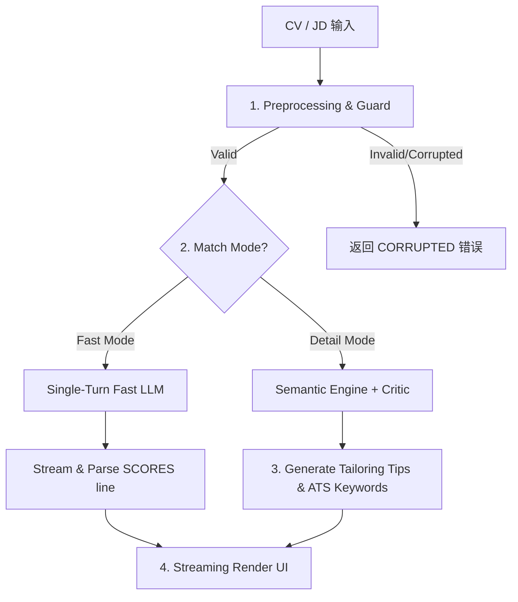

# Kiwi Match 管道優化 (JobSync 引入) —— Goal & Spec

本文件定義了將 `JobSync` 專案的 ATS 匹配特性引入 `Kiwi-AI-interview-Agent` 的系統優化目標（Goal）與技術規格（Spec）。

---

## 1. Goal (目標與成功指標)

### 核心問題
1. **魯棒性不足**：CV/JD 原文若包含損壞字元（如損壞 PDF 讀出的亂碼或二進位資料），系統會直接送入 LLM/Embedding，浪費 API 費用且易引發後端崩潰。
2. **單一重型匹配**：無論使用者是需要深度面試準備，還是只想快速對比多個履歷/職缺，系統一律執行雙階段 Critic + Vector Embedding 匹配，造成時延與成本居高不下。
3. **缺乏求職端修改建議**：報告著重於面試考點（Evidence Map），缺乏具體「在哪個章節補上哪些關鍵字」的實用履歷優化指引。
4. **同步等待焦慮**：前端渲染必須等待完整的 JSON Payload 生成，使用者體驗不夠即時流暢。

### 成功指標 (Success Metrics)
* **安全攔截率**：100% 攔截損壞、過短或垃圾二進位檔案，直接回傳 `CORRUPTED` 錯誤，不呼叫 LLM。
* **快速模式時延**：快速匹配模式（Fast Mode）的後端執行耗時降至原本的 **30% 以下**。
* **功能覆蓋率**：深度匹配模式下，報告 100% 產出「ATS 關鍵字比對」與「修改建議（Tailoring Tips）」。
* **體感加載時間**：前端藉由 streaming 渲染，首字呈現時間（Time to First Token）小於 **1.5 秒**。

---

## 2. Spec (技術規格與需求)

### Spec 1: Preprocessing & Guard (文字預處理與損壞判定防衛閘)
* **需求細節**：
  - 在進入匹配前，對 CV 與 JD 原始文字進行清洗與收攏：
    - `removeHtmlTags`：將 HTML 標籤移除，並將 `<li>` 統一轉換為標準的 `•`（以利語意比對）。
    - `normalizeBullets`：將常見的 Bullet 符號（如 `●`, `▪`, `✓`, `★`, `-`, `*` 等）收攏為單一符號 `•`。
    - `validateText`：檢查文字字元數是否少於 200 字（過短），或包含過長連續特殊字元（大於 20 個連續非字母數字字元）。
* **預期行為**：
  - 若校驗失敗，直接回傳 `400 Bad Request`，並回傳 Error Code `CORRUPTED` 或 `TOO_SHORT`，不觸發下游 Embedding 與 LLM 呼叫。

### Spec 2: Dual-Mode Matching (雙模式匹配機制)
* **需求細節**：
  - 在 `compareCvToJobDescription` 中引入 `settings.matchMode = 'fast' | 'detail'` 控制項。
  - **`fast` 模式 (快速預篩)**：
    - 停用語意 Embedding 向量比對、Role-Fit 診斷、DeepSeek Critic 雙階段校驗。
    - 採用單次輕量 Prompt，直接對比 CV 與 JD 原文，僅輸出數值分數（0-100）、推薦等級以及 2-3 句的 Summary。
  - **`detail` 模式 (深度面試準備)**：
    - 維持現有的多維度評分、Role Evidence Map 證據鏈與 DeepSeek Critic 二次校正。

### Spec 3: Resume Tailoring & ATS Keywords (履歷修改與 ATS 關鍵字產出)
* **需求細節**：
  - 在 `detail` 模式下，匹配報告增加兩個面向：
    - **`atsKeywords`**：JD 中有要求，但 CV 中完全缺失的 verbatim（一字不差）專業名詞與技術關鍵字。
    - **`tailoringTips`**：針對 CV 的具體修改引導，例如「建議在 Work Experience 第三段加入使用 React 做狀態優化的經歷描述」。
  - 擴展 [matchResultFormatter.js](file:///Users/heminghan/Kiwi-AI-interview-Agent/backend/src/services/match/matchResultFormatter.js) 輸出 schema，包含 `atsKeywords[]` 與 `tailoringTips[]` 物件。

### Spec 4: Stream Protocol & Isomorphic Parsing (串流管道與前端即時解析)
* **需求細節**：
  - 改造後端 `/api/analyze/match` 介面，支援 SSE 流式傳輸。
  - 後端 LLM 輸出格式的首行必須統一為機器可讀格式：
    `SCORES: match=<0-100> recommendation=<strong|good|partial|weak>`
  - 後續內容則為 Markdown 格式之報告本文。
  - 前端實作同構解析器（Isomorphic Parser），在串流首行到達時解析出 `matchScore` 與 `recommendation`，並在畫面上渲染分數卡片，同時將後續流式到達的 Markdown 內容直接做打字機渲染。
