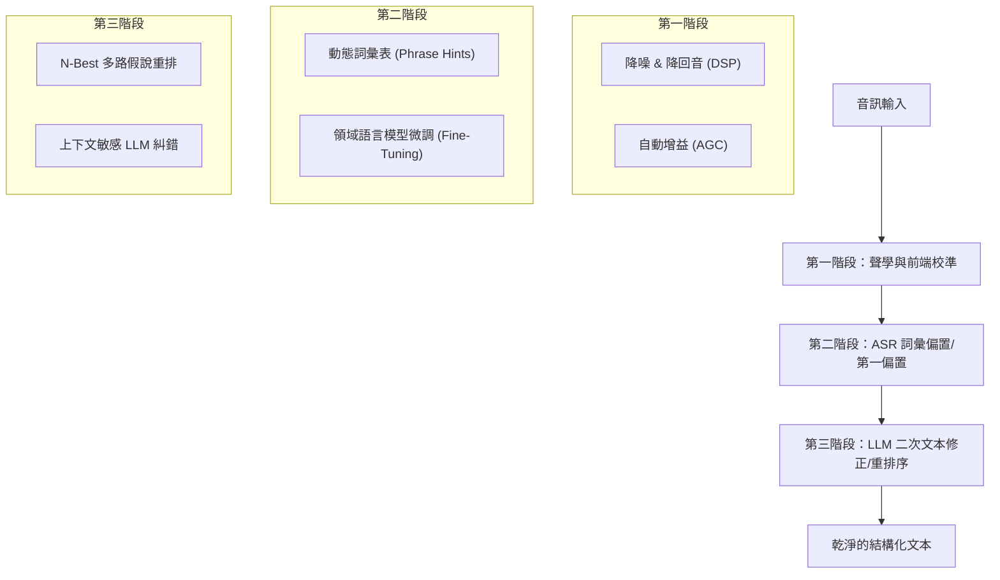

# 語音識別（ASR）校準與文本修正研究報告

在語音面試與會議語音轉文字（Speech-to-Text, STT）系統中，如何提高轉寫的準確性（特別是專業術語、專有名詞及口音容錯）是提升下游 AI 評分可信度的核心關鍵。本報告整理了目前業界（如 Zoom AI Companion）與開源社群常見的 ASR 語音校準與文字修正技術。

---

## 1. 語音識別校準的核心技術維度

目前業界主要透過以下三個維度來優化 ASR 的精準度：

### 1.1 第一階段：聲學與前端校準 (Acoustic Calibration)
在音訊進入 ASR 引擎之前，對音訊訊號進行前置處理，以消除環境雜音：
*   **回音消除 (Echo Cancellation) 與降噪 (Noise Suppression)**：利用 DSP（數位訊號處理）算法過濾鍵盤敲擊聲、冷氣風扇聲等背景雜訊。
*   **自動增益控制 (Auto Gain Control, AGC)**：自動調整輸入音量，避免候選人因距離麥克風過遠導致聲音過小，或過近導致爆音。
*   **Zoom 的作法**：Zoom 提示用戶啟用「高保真音樂模式 (High-Fidelity Music Mode)」，並利用端點設備的硬體加速或 WebRTC 前端降噪，確保傳輸給 ASR 引擎的音軌品質最優。

### 1.2 第二階段：第一階段偏置 (ASR Vocabulary Bias / Phrase Hints)
在 ASR 解碼過程中，提供提示詞列表，提高特定術語的識別概率：
*   **動態熱詞偏置 (Dynamic Hotwords)**：向 ASR 引擎傳入一組「熱詞清單」（例如：`React`、`Kubernetes`、`RAG`）。當 ASR 引擎在聲學特徵上判定某字音接近熱詞時，會優先解碼為熱詞，而非日常同音字（如將 `rag` 辨識為垃圾 `rag`，而非技術術語 `RAG`）。
*   **Zoom 的作法**：Zoom AI Companion 提供 **Custom Dictionaries（自定義字典）** 功能，允許企業管理員在後台匯入含有最多 1,000 個企業專有名詞、縮寫或產品名稱的 CSV 檔案，以直接提升 ASR 辨識率。
*   **雲端 API 支援**：Microsoft Azure Speech 與 Google Cloud STT 皆提供 `PhraseListGrammar` 或 `SpeechAdaptation` 介面，允許在發起連線時動態傳入熱詞並給予權重權衡。

### 1.3 第三階段：第二階段文本修正 (Second-Pass ASR Error Correction)
在 ASR 輸出文字後，利用自然語言處理（NLP）或大型語言模型（LLM）對轉寫結果進行拼寫糾錯與語意校正：
*   **N-Best 多候選假說重排序 (N-Best Hypotheses Re-ranking)**：
    *   ASR 引擎通常不會只輸出一個結果，而是輸出前五個可能符合的句子列表（即 N-Best），並附帶每個單字的信心度得分。
    *   開源專案（如 Microsoft *FastCorrect*、*SoftCorrect*）會將 N-Best 列表與上下文（如 JD、面試題）一起輸入給一個小型語言模型，由 LLM 從中選擇在語意上最合理、最符合上下文的句子。
*   **上下文敏感 LLM 糾錯 (Context-Aware LLM Post-Correction)**：
    *   將 ASR 輸出的 Raw Text，伴隨面試的上下文（如：目標職位 JD、當前提問、候選人 CV 技能）傳入一個超快速的 LLM。
    *   **Prompt 範例**：
        > "你是一個專業的語音轉寫糾錯助手。請在不改變候選人回答原意的情況下，修正這段語音轉寫中的技術術語拼寫錯誤與同音字。請參考以下上下文：
        > - 當前問答主題：${topic}
        > - JD 關鍵字：${jdKeywords}
        > - 原始轉寫：${rawText}
        > 輸出修正後的文字，禁止無中生有或潤飾候選人的語句。"

---

## 2. 業界與開源專案對比

| 解決方案 / 專案 | 聲學前端優化 | 偏置詞典 (First-Pass) | 二次文本修正 (Second-Pass) | 延遲性 (Latency) | 適用場景 |
| :--- | :--- | :--- | :--- | :--- | :--- |
| **Zoom AI Companion** | 極強 (具備內建 DSP 降噪、AGC 與高保真音訊設定) | 支援管理員匯入 Custom Dictionaries (最多 1,000 詞) | 支援會議結束後的 AI 摘要校正與手動校對 | 低 (即時字幕) 至 高 (會後摘要) | 會議錄音、企業內通訊 |
| **Microsoft FastCorrect / SoftCorrect** | 無 (依賴輸入源) | 支援 Azure PhraseList | 強 (使用輕量神經網絡，針對 ASR 錯誤模式做 Token 級修正) | 極低 (小於 50ms) | 即時對話系統、低延遲語音助理 |
| **開源 LLM 糾錯管道 (如 LangChain + DeepSeek)** | 無 (需自行串接 WebRTC) | 依賴 ASR 引擎本身 | 極強 (可融入極為複雜的語意上下文進行精準修正) | 中等 (依據 LLM 回應速度，約 300ms - 800ms) | 非即時轉寫、異步報告生成、高精準度需求 |
