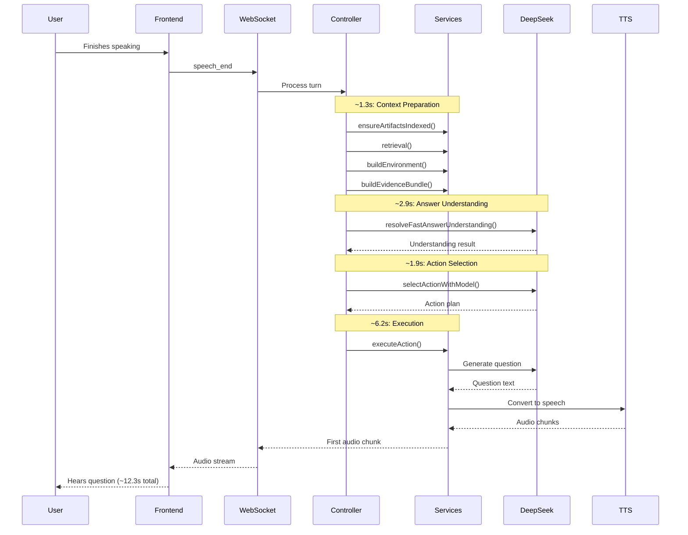
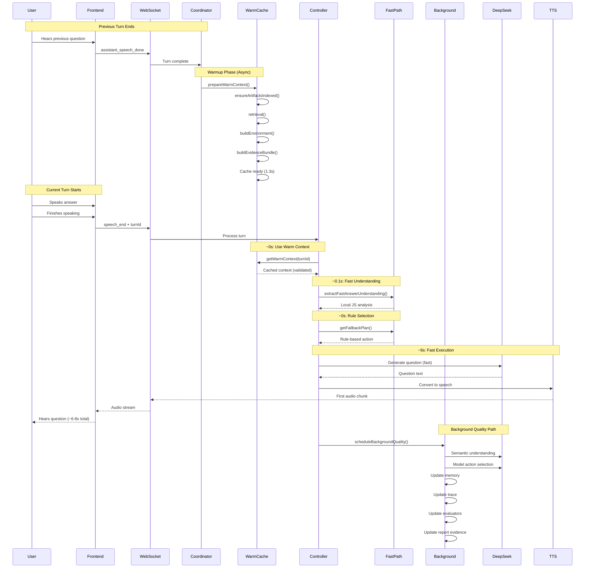
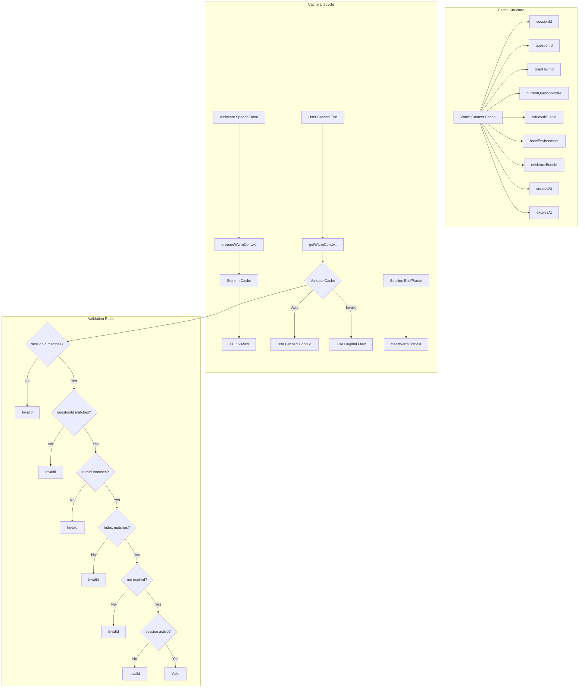
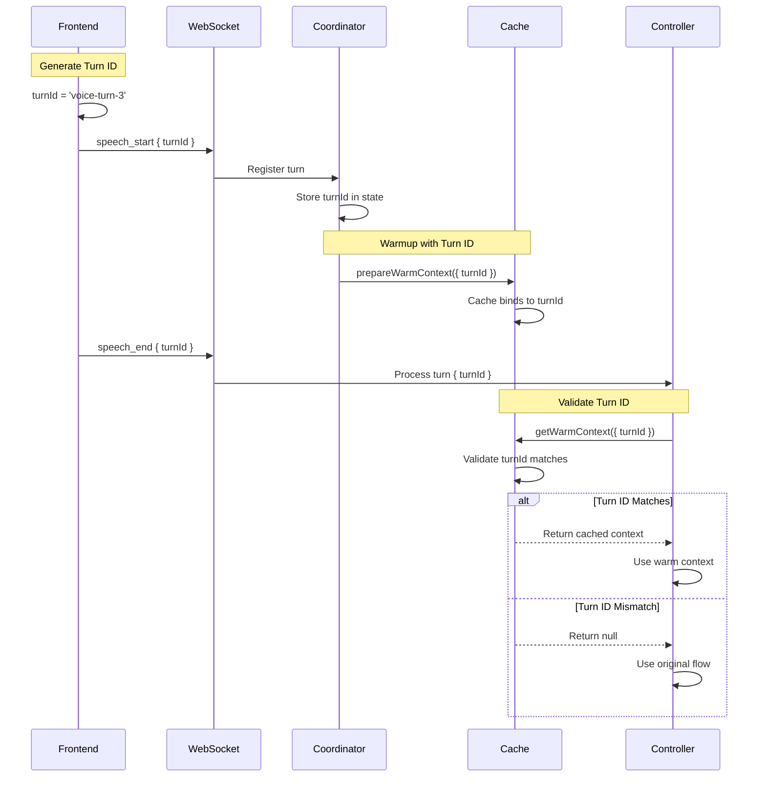
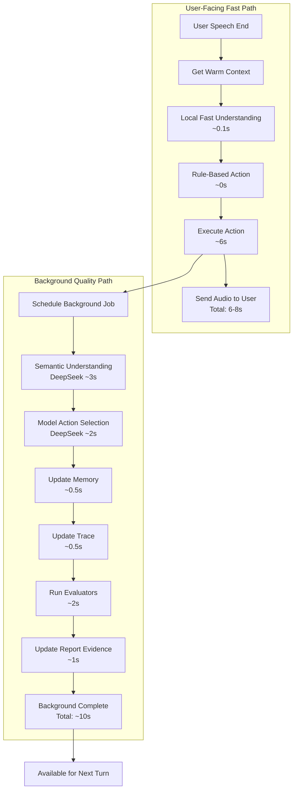
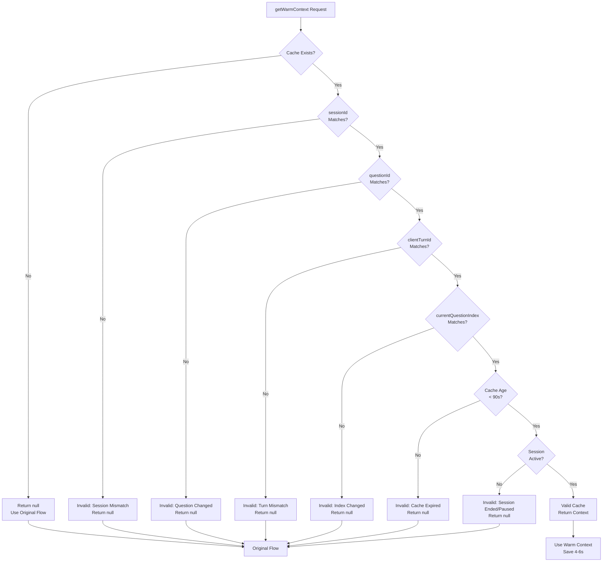
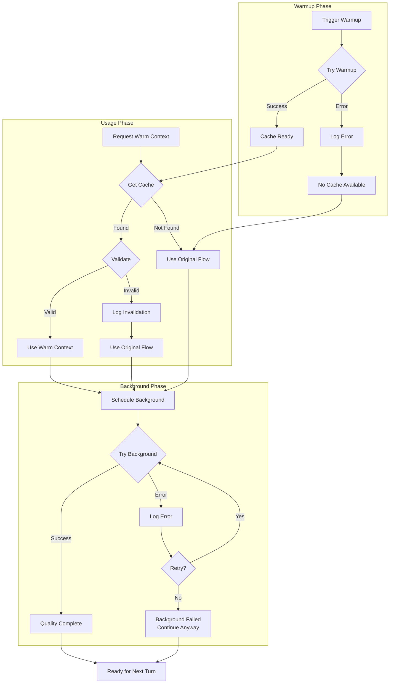
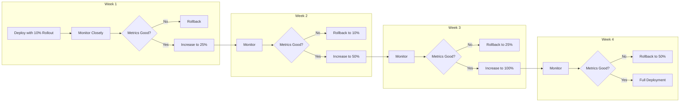
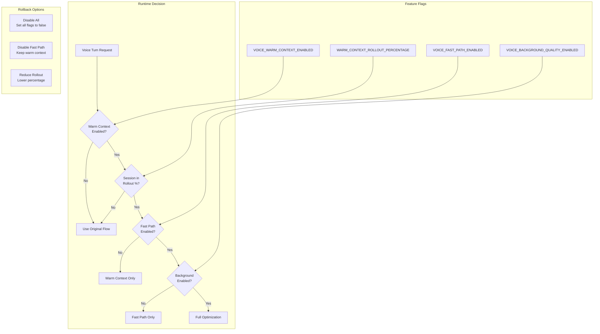

# Voice Latency Optimization Architecture

> Status: historical target architecture. Parts are implemented, but this file is not a current component inventory. Use `docs/implementation-workflows.md`, `docs/voice-latency-trace-markers.md`, and runtime code for present behavior.

## Current Architecture (Synchronous Pipeline)



**Total Latency**: ~12.3 seconds
- Context preparation: 1.3s
- Answer understanding: 2.9s
- Action selection: 1.9s
- Execution (DB + LLM + TTS): 6.2s

---

## Optimized Architecture (Warm Context + Fast Path)



**Total Latency**: ~6-8 seconds (4-6s saved)
- Context preparation: 0s (pre-warmed)
- Answer understanding: 0.1s (local JS)
- Action selection: 0s (rule-based)
- Execution (DB + LLM + TTS): 6-8s

**Background Quality**: Completes within 10s for next turn

---

## Warm Context Cache Architecture



---

## Turn Identity Flow



---

## Fast Path vs Quality Path



---

## Cache Validation Decision Tree



---

## Error Handling & Fallback Strategy



---

## Monitoring & Observability

```mermaid
graph TB
    subgraph "Latency Metrics"
        L1[voice_turn_total_latency]
        L2[voice_turn_warmup_latency]
        L3[voice_turn_cache_validation_latency]
        L4[voice_turn_fast_understanding_latency]
        L5[voice_turn_rule_selection_latency]
        L6[voice_turn_background_quality_latency]
        L7[voice_turn_first_audio_sent]
    end
    
    subgraph "Quality Metrics"
        Q1[voice_turn_cache_hit_rate]
        Q2[voice_turn_cache_invalidation_rate]
        Q3[voice_turn_fallback_rate]
        Q4[voice_turn_background_failure_rate]
        Q5[voice_turn_background_lag]
        Q6[voice_turn_quality_score]
    end
    
    subgraph "Error Metrics"
        E1[voice_turn_warmup_error]
        E2[voice_turn_cache_error]
        E3[voice_turn_validation_error]
        E4[voice_turn_background_error]
    end
    
    subgraph "Alerts"
        A1[Cache validation failure > 10%]
        A2[Background failure > 5%]
        A3[Latency regression > 20%]
        A4[Error rate increase > 5%]
    end
    
    Q2 --> A1
    Q4 --> A2
    L1 --> A3
    E1 --> A4
    E2 --> A4
    E3 --> A4
    E4 --> A4
```



---

## Deployment Strategy



---

## Feature Flag Architecture



---

## Data Flow Comparison

### Before Optimization
```
User Speech End
    ↓
[1.3s] Context Preparation (blocking)
    ↓
[2.9s] Semantic Understanding (blocking)
    ↓
[1.9s] Model Action Selection (blocking)
    ↓
[6.2s] Question Generation + TTS (blocking)
    ↓
User Hears Response (12.3s total)
```

### After Optimization
```
Previous Turn Ends
    ↓
[1.3s] Context Preparation (async warmup)
    ↓
User Speech End
    ↓
[0s] Use Warm Context (cached)
    ↓
[0.1s] Fast Understanding (local JS)
    ↓
[0s] Rule Selection (local)
    ↓
[6s] Question Generation + TTS (blocking)
    ↓
User Hears Response (6-8s total)
    ↓
[10s] Background Quality Path (async)
```

**Savings**: 4-6 seconds per turn

---

## Risk Mitigation Summary

| Risk | Impact | Mitigation | Fallback |
|------|--------|------------|----------|
| Stale Cache | Wrong context used | Validate before use | Discard, use original flow |
| Partial Transcript | Premature decisions | Only use for local analysis | Wait for final transcript |
| Turn Mismatch | Cache used by wrong turn | Bind cache to turnId | Validation fails, use original |
| Warmup Waste | Resource waste | Only warmup after assistant done | Low cost, acceptable |
| Rate Limits | DeepSeek throttling | No DeepSeek in warmup/partial | Background only |
| Quality Loss | Poor follow-ups | Background quality path | Maintain full quality async |
| Session Changes | Cache invalidated | Check session status | Validation fails, use original |
| Background Failure | Missing quality data | Retry with backoff | Continue, log error |

---

## Success Criteria

### Latency
- ✅ Total latency reduced from 12.3s to 6-8s
- ✅ Cache hit rate > 80%
- ✅ Cache validation overhead < 50ms
- ✅ Background quality completes within 10s

### Quality
- ✅ Report quality maintained (no degradation)
- ✅ Memory updates complete successfully
- ✅ Trace records complete
- ✅ Follow-up questions remain relevant

### Reliability
- ✅ Cache invalidation rate < 10%
- ✅ Fallback rate < 20%
- ✅ Background failure rate < 5%
- ✅ No increase in error rates

### User Experience
- ✅ User satisfaction maintained or improved
- ✅ No complaints about question quality
- ✅ Perceived responsiveness improved
