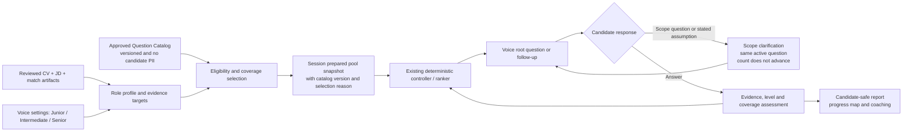

# Voice Question Intelligence Master Plan

> **狀態：CP1–CP4 local implementation、deterministic tests 與 candidate-safe projections 已完成；Mongo actual activation、human wording/privacy review、Voice/browser 與 live-provider 驗證仍未在此 working tree 證明。**<br>
> **範圍：Voice interview only。**<br>
> 本文件定義目標架構、分期、資料契約、驗證與 human checkpoints。Source-controlled review manifests、local implementation 與 test pass 不等於 database activation、candidate-visible rollout、deployment 或 production readiness。Text interview 行為不在本次範圍內。

## 1. 為什麼要做這件事

Kiwi 現在已能由 CV、JD、match gap 和既有 behavioral fallback 準備問題，並在面試中依回答做有限追問。但它仍主要知道「可問哪些題」，還不足以穩定地回答：

1. 這一題在這個角色、這個 seniority 下究竟想測什麼？
2. 這題應該直接問、給情境問，還是保留範圍讓候選人展示澄清能力？
3. 哪些 AI／ML 題是這個角色真的常見且合理的，而不是模型臨場想到的流行名詞？
4. 候選人問澄清問題時，voice controller 應如何回應且不破壞 question counting、report grounding 或 latency contract？
5. report 怎麼區分「答案內容不足」、「選錯例子」與「合理但沒有說清楚假設」？

這個計畫把上述問題整合成一個 voice-first、evidence-aware 的模擬面試系統。它是 coaching product，不是 employer-side screening、ranking 或 hiring-decision automation。

## 2. 審閱時應先確認的產品決策

下表是本 Master Plan 採用的 defaults。Product Owner 在 CP0 可以核准、修改或拒絕任一項；未來每份 Goal / Spec 不可默默改寫它。

| 決策 | 本計畫採用的規則 | 原因 |
| --- | --- | --- |
| 面試真實感 | 強制的是 competency coverage，不是每場逐字問完固定題庫。 | 真人面試會依回答追問；固定 script 反而不自然。 |
| 角色 level | 新 canonical 值為 `Junior`、`Intermediate`、`Senior`。舊 `advanced` 僅由 compatibility adapter 讀取並映射為 `senior`。 | UI、文件與 JD 用語一致，同時保護舊 session。 |
| Level authority | 使用者在 Voice 設定選的 level 是最終 authority；JD seniority 只作預設建議與 mismatch diagnostics。 | 不應讓不可靠的 JD parser 覆蓋使用者意圖。 |
| AI 題 policy | 明確分開 `eligible`、`prepared`、`reserved` 與 `asked`：Non-tech 的 AI judgement 只在有 role / JD / user focus signal 時可選，最多問 1 題；Software / Data 的完成 8+ 題 session 必問 1 個 AI workflow root family；AI Solution 或 JD 命中強 AI-delivery signal taxonomy 的完成 8+ 題 session 必問 2 個不同 AI root family。 | 防止「0–1／至少 1／至少 2」混成不透明的隨機規則，也不把工具名稱侷限於三個字。 |
| ML 題 policy | 只有 Data Science、ML、AI/ML engineering，或 JD 有明確 ML signals 時才選 ML family。 | 避免把 ML theory 強加到一般 Software、Data Analyst 或 non-tech role。 |
| 刻意歧義題 | 8 題面試最多 0–1 題 `open_scope_probe`；Junior 預設不用。 | 用來測需求釐清，不把 mock interview 變成猜題遊戲。 |
| 澄清評價 | 明確要求澄清最強；先說合理假設並請確認為合格；未說明假設直接作答是 coaching gap，不是「答錯」。 | 評估 assumption control，不懲罰合理專業判斷。 |
| 題庫治理 | AI／ML 和所有 reusable 題目先進 versioned global catalog，再 snapshot 到每場 session pool。 | 防止 LLM 臨場亂問，並保留可追溯性、rollback 與歷史重現。 |
| Live authority | Existing deterministic controller / ranker 仍決定選題與 state；LLM 只在 bounded contract 內 naturalize wording 或完成既有 structured extraction。 | 保護 voice latency、可測性與既有 controller authority。 |
| Candidate visibility | Live interview 不展示完整 pool、ranking、私有 evidence ID、internal intent 或參考答案；report 只給 candidate-safe coaching。 | 保持面試自然且不洩漏 private artifacts。 |

## 3. Current baseline and gaps

### 已實作的基礎

- CV seed、JD requirement / filter、match validation / gap、fallback 與 behavioral material 可組成 prepared question pool。
- 每場 session 的 `InterviewQuestionPoolItem` 已帶有 `userId`、`sessionId`、source、evidence、rank trace、status 和 retention；它是 **session snapshot**，不是共用題庫。
- CP1/CP2 的 local implementation 已把 seniority blueprint 正規化為 `junior`、`intermediate`、`senior`；legacy `advanced` input 讀取時映射為 `senior`，前端新設定顯示並送出 `Senior`。
- `2026.1` / `2026.2` global catalog source manifests、AI/ML taxonomy、Voice-only private snapshot、reservation trace 與 follow-up-vs-next-root comparator 已有 local test coverage；runtime 不接受 request pinning，固定依序載入 database `approved` 的 `2026.2`、`2026.1`，不可用時降級。Source digest/manifest 並非 target Mongo 已 seed 或 activation 的證據。
- voice contract 已要求 repair、repeat、transcript confirmation、clarification 等非正式題不得推進 interview question count，也不得進 accepted-answer scoring dataset。
- CP3 local implementation 已在正常 Voice interview stage 加入 deterministic question-scope lane；符合 versioned prepared context 的 candidate scope question 可走 `ANSWER_QUESTION_SCOPE`，缺 context 或重複請求則 fail closed 到 bounded rephrase/scaffold。
- report 的 answer alignment 以 accepted answers 為主，現已提供 clarification / assumption / AI judgement coaching、per-session progress hypotheses 與 optional candidate-provided reflection；新 coaching 不會改寫分數。Session、report read/QA-rewrite、JSON/TXT/PDF projections remove catalog/policy, evidence/proof, coverage/role-intent, turn/question and claim/source/chunk IDs, grounding and rewrite internals before candidate delivery.

### 本計畫要補的 gap

| Gap | 目標狀態 |
| --- | --- |
| 題目只是來源導向 | 題目同時具備 competency、role intent、level、expected signal、eligibility 與 follow-up contract。 |
| `Advanced` / `Senior` 混用 | 新資料和 UI 統一為 `Senior`；legacy reader 支援 `advanced`。 |
| reusable 題目散落於 code / generated pool | 有受版本、research、review 管理的 global catalog；每場只使用合格 snapshot。 |
| AI / ML 題隨 JD 關鍵字或模型自由產生 | 只由 approved question families + deterministic eligibility 進 pool。 |
| candidate clarification 被當成 generic misunderstanding | 已有明確的 question-scope clarification state、bounded response policy 與 non-countable persistence；human Voice/browser activation evidence 仍待補。 |
| report 缺少 assumption coaching | 以 candidate-safe wording 回饋 scope framing、clarification judgement 與 AI judgement。 |

### 證據狀態

本節以目前 working tree 為準。現有 question pool 與 session persistence 以 `backend/src/services/questions/`、`backend/src/db/models/interviewQuestionPoolItemModel.js` 為主；voice 行為以 `VOICE_INTERVIEW_PRODUCT_BEHAVIOR.md` 為產品契約。CP1 catalog contract、Senior migration、CP2 recommendation policy、CP3 scope action 與 CP4 report coaching 已在本地實作；`2026.2` 會僅在資料庫具 `approved` entries 時優先載入，否則回退。Mongo lifecycle、human Voice replay 和 candidate-visible browser review 尚未在此記錄中驗證。

## 4. Target architecture



架構只有一個 question authority：prepared pool + existing controller。Catalog 是 reusable content authority；session pool 是當次事實與歷史 snapshot authority。不能新增第二個 orchestrator，也不能讓 model 自由發現題目、tool 或 scoring policy。

## 5. Canonical data contracts

### 5.1 Global `QuestionCatalogItem`（CP1 local implementation）

此 collection 沒有 CV、JD、transcript、user ID 或 session status。每個 entry 是一個人工審核後、可版本化的 question family 或其 level-specific variant。

```js
{
  catalogQuestionId: "ai_assisted_delivery",
  catalogVersion: "2026.1",
  lifecycle: "draft | approved | deprecated | disabled",
  questionFamily: "ai_assisted_delivery",
  questionType: "ai_workflow",
  competency: "reliable_ai_delivery",
  targetLevels: ["junior", "intermediate", "senior"],
  roleEligibility: {
    roleFamilies: ["software", "data", "ai_solution"],
    requiredJdSignals: [],
    optionalCandidateSignals: ["ai_project", "coding_project"]
  },
  promptVariants: [],
  expectedSignals: ["ownership", "verification", "result"],
  followUpPolicy: [],
  ambiguityPolicy: { mode: "none" },
  researchBasis: {
    frequencyBand: "high | role_specific | curated",
    sources: [],
    reviewedAt: "YYYY-MM-DD"
  },
  humanReview: { reviewer: null, approvedAt: null }
}
```

Catalog lifecycle 的規則：

- `draft`、`deprecated`、`disabled` 不可被 runtime 選入新 session。
- `approved` 才可參與 eligibility 與 ranking。
- 對題目 wording、eligibility、expected signals 或 scoring relevance 的任何實質改動都建立新 `catalogVersion`，不覆寫既有版本。
- source material 只能記錄研究摘要與 URL / publication metadata；不得複製外部題庫答案，也不得保存 candidate data。

### 5.2 Existing session `InterviewQuestionPoolItem`（CP1／CP2 local extension）

現有 session pool 保留為 runtime / history source of truth。新欄位是 backward-compatible optional fields：

```js
{
  catalogQuestionId: "ai_assisted_delivery",
  catalogVersion: "2026.1",
  targetLevel: "senior",
  questionType: "ai_workflow",
  testedSignals: ["ownership", "verification"],
  eligibilityReason: ["role_family_ai_solution", "jd_mentions_agent"],
  selectionPolicy: { minPerInterview: 0, maxPerInterview: 1 },
  ambiguityMode: "none | bounded_scenario | open_scope_probe",
  clarificationContextVersion: null,
  reportDimensions: ["ai_judgement", "evidence", "clarification"]
}
```

每場開始前，系統只將當場 eligible 的 approved catalog entries contextualize 後 snapshot 進 pool。Catalog 更新、停用或修訂，不得改變已開始 session 的 question history、rank trace 或 report grounding。

### 5.3 Compatibility

- New Voice sessions 寫入 `senior`，不再寫入 `advanced`。
- Legacy session / plan / API input 的 `advanced` 仍讀作 `senior`，直到有明確 retention-window cleanup plan。
- 如果 catalog unavailable，維持既有 bounded fallback；輸出應標記 `catalog_unavailable` / `pool_degraded`，不能假裝已符合 AI／ML coverage。
- 新 contract 必須和既有 schema version、question dedupe、resume flow、question count 和 retention 一起測試。

## 6. Question catalog and selection policy

### 6.1 Candidate question families

這些是 family，不是每一場必逐字問完的 script。

| Family | 適用條件 | 核心 signal |
| --- | --- | --- |
| `company_role_internship_motivation` | 已知 company / role；internship 只在 JD 明確是 internship | 動機具體、角色理解、成長目標 |
| `group_failure_learning` | 有團隊 project / work evidence | 責任、修正、反思 |
| `learning_agility_self_teach` | 所有 role eligible | 面對困難新知的起步、驗證與持續學習 |
| `initiative_value_creation` | 有改善流程、產品或服務的情境 | 主動性、受益者、impact |
| `support_struggling_teammate` | 團隊型角色 | 協作、同理、界線與結果 |
| `career_transition_hardware_to_ai_solution` | CV / target role 顯示該轉換 | 動機、可轉移工程能力、gap honesty |
| `role_motivation_ai_solution` | AI Solution / similar role | business problem、delivery interest、stakeholder fit |
| `proud_project` | 有可佐證 project | ownership、decision、impact |
| `underperforming_project_reflection` | 有 project / work evidence | failure handling、學習、下一次改法 |
| `conflict_resolution` | 團隊 / stakeholder context | 溝通、衝突處理、共同結果 |
| `nz_study_work_motivation` | 只能由 CV 中明確的 NZ study / relocation / work signal 啟用；不得由姓名、國籍或推測啟用 | 職涯動機、適應與未來方向 |
| `coding_ownership_and_verification` | Software / Data / AI role 且有 build claim | 本人決策、implementation ownership、verification |

`coding_ownership_and_verification` 的語氣必須避免預設候選人不誠實。它應問候選人在自己或 AI assistance 下負責了哪些決策、實作和驗證，而非用「你真的自己寫嗎」作指控。

### 6.2 AI / ML catalog groups

| Group | Eligible role | 不可濫用到的角色 | 評估重點 |
| --- | --- | --- | --- |
| `ai_literacy_responsible_use` | Non-tech with workflow / digital-improvement context | 不可變成 ML theory quiz | AI 適用邊界、human judgement、privacy / risk awareness |
| `ai_assisted_delivery` | Software / Data / AI Solution | 不要求 GPU / model-serving knowledge | planning、coding、debugging、testing、verification |
| `prompt_and_context_design` | AI Solution，或 JD 命中 strong / medium AI-delivery signal taxonomy | 不以「神奇 prompt」取代工程能力 | context、constraints、examples、acceptance criteria、iteration |
| `rag_retrieval_design` | AI Engineer / Solution，且 JD 有 RAG / retrieval / knowledge context | 一般 non-tech / generic SWE | retrieval quality、permission、freshness、grounding |
| `agent_reliability_and_safety` | AI Engineer / Solution | 不把 multi-agent 當成預設解法 | tool failure、autonomy limit、human review、observability |
| `ai_evaluation_and_cost` | AI Engineer / Solution | 不只問「temperature 是什麼」 | golden set、quality / safety measurement、latency、cost |
| `ml_problem_framing` | Data Science / ML / AI-ML Engineer | generic Software / Data Analyst unless JD requires it | 是否該用 ML、target、data and baseline |
| `ml_data_and_evaluation` | Data Science / ML | generic AI tool-use role | split、leakage、metric、subgroup coverage |
| `ml_delivery_and_monitoring` | ML Engineer / Senior data / production ML JD | entry-level data role unless JD requires it | versioning、deployment、drift、monitoring、rollback |

### 6.2.1 AI-delivery signal taxonomy

「JD 明確要求 AI / agent」不是只比對 `Codex`、`Claude`、`agent` 三個字，也不應靠一個長期不更新的 regex。P1 必須建立 versioned alias taxonomy；下列是 2026.1 seed 的完整類別與常見 alias 範圍。Alias 是 routing evidence，不是 employer truth，也不代表每個字都必須生成同一題。

| Signal family | Seed aliases / examples | Signal strength | 主要導向的 question families |
| --- | --- | --- | --- |
| AI-delivery role / responsibility | AI Solution Engineer、AI Engineer、LLM Engineer、Generative AI Engineer、Applied AI Engineer、AI Product Engineer、AI Automation Engineer、Prompt Engineer、Forward Deployed AI、AI platform / agent delivery；build、ship、evaluate、deploy、operate AI / LLM product | Strong | `ai_assisted_delivery` + 最符合 JD 的第二個 AI family。 |
| Foundation model / provider / API | OpenAI、ChatGPT、GPT、Azure OpenAI、Anthropic、Claude、Google Gemini、Vertex AI、Gemini API、AWS Bedrock、Amazon Nova、Mistral、Cohere、model API、LLM API | Medium；若同時有 delivery verb 或另一 strong signal 可升級 | `ai_assisted_delivery`；若 JD 有 evaluation / retrieval / tools 再加對應 family。單一 provider name 不自動觸發兩題。 |
| Coding assistants and coding agents | Codex、ChatGPT Codex、Claude Code、GitHub Copilot、Copilot coding agent、Cursor、Windsurf、Gemini Code Assist、Gemini CLI、Amazon Q Developer、JetBrains AI Assistant、Junie、Replit Agent、Devin、Augment Code、Sourcegraph Cody、Tabnine、Cline、Roo Code、Aider、Continue、OpenCode | Strong，若職責包含 delivery / review / test / PR；否則 Medium | `ai_assisted_delivery`；第二題依 JD 選 `prompt_and_context_design` 或 `ai_evaluation_and_cost`。 |
| Agent / orchestration framework | OpenAI Agents SDK、Anthropic Agent SDK、Google ADK、LangChain、LangGraph、LlamaIndex、Semantic Kernel、AutoGen、CrewAI、Haystack、Vercel AI SDK、agent workflow、multi-agent、orchestration | Strong | `agent_reliability_and_safety`；視 JD 加 `prompt_and_context_design` 或 `ai_evaluation_and_cost`。 |
| Tool and interoperability pattern | MCP、Model Context Protocol、A2A、Agent2Agent、tool calling、function calling、API tools、computer use、workflow automation、human-in-the-loop、approval gate | Strong | `agent_reliability_and_safety`，並測 autonomy boundary、tool failure、approval、audit。 |
| Retrieval / knowledge-grounding pattern | RAG、retrieval-augmented generation、embeddings、vector search、vector database、semantic search、hybrid search、reranking、chunking、knowledge base、grounded answer、citation | Strong | `rag_retrieval_design` + `ai_evaluation_and_cost`。 |
| Prompt / context pattern | prompt engineering、system prompt、prompt template、few-shot、structured output、JSON schema、context window、context engineering、instruction hierarchy、prompt injection | Medium；與 coding agent / LLM app / AI role 結合時升 Strong | `prompt_and_context_design`；必要時加 safety / evaluation follow-up。 |
| Evaluation / observability / safety | evals、evaluation harness、golden set、LLM-as-judge、human review、prompt versioning、trace / tracing、observability、LangSmith、Langfuse、Phoenix、Arize、Weave、Promptfoo、Ragas、guardrail、hallucination、red teaming、safety evaluation | Strong | `ai_evaluation_and_cost`；必要時加 `agent_reliability_and_safety`。 |
| Model serving / AI infrastructure | inference、serving、batching、GPU、vLLM、TensorRT-LLM、quantization、fine-tuning、LoRA、latency、token cost、model gateway、cache | Strong only for infrastructure / model-serving responsibility | `ai_evaluation_and_cost` 或 infra-specific variant；不把它派給 generic application Software role。 |
| Generic / weak AI wording | AI-powered、AI-enabled、familiar with AI、interest in AI、automation、copilot、ChatGPT without delivery responsibility | Weak | 最多進 `ai_literacy_responsible_use` 或 general `ai_assisted_delivery` candidate；不產生 mandatory second AI family。 |

Alias set 必須和角色 taxonomy 一樣放在版本化 catalog / seed，而不是散落在 prompt。每一個 alias 還應記錄 canonical key、family、strength、deprecation status、last reviewed date 和 source. 新工具可以透過 P1 catalog review 加入，舊工具則可 deprecated；因此「寫全」指的是完整的分類與可維護的收錄機制，而不是聲稱列出未來所有產品名稱。

#### Strength resolution

1. AI Solution / AI Engineer 等 direct role identity，或任何一個 Strong signal，滿足 `explicit_ai_delivery`。
2. 兩個不同 Medium signals（例如 model provider + prompt / evaluation responsibility）也滿足 `explicit_ai_delivery`。
3. 單一 Medium signal 只使 AI workflow 更高優先，不自動要求第二個 AI root。
4. Weak signal 不可提升為 explicit AI delivery；只能讓 optional AI judgement eligible。
5. 明確 ML signals 使用獨立 ML taxonomy，不因為出現 AI tool alias 就產生 ML theory question。

這套 taxonomy 的用途是保證「為什麼問 AI 題」可說明，而非讓 keyword matching 決定 candidate 能力。若 JD signal 互相矛盾或太弱，pool 要標 `ai_signal_ambiguous` 並退回較保守的 generic / optional policy。

### 6.3 Research and approval gate for AI / ML

AI / ML question families 不可由 LLM 在 runtime 自行擴張。每次 catalog seed / revision 先經下列流程：

1. 蒐集至少兩個獨立 market / candidate-reported interview source，並以近期 JD signals 對照。
2. 將外部題型整理成 Kiwi 自己的 competency family；不直接複製題庫 wording 或答案。
3. 對每個 family 標記 role scope、level、expected signals、何時不應問，以及 research date。
4. 建立 fixture，覆蓋應選與不應選情境。
5. 由 human reviewer 核准 `draft -> approved` 後，才可進新 session pool。

2026-07-29 的初步研究只作為 seed input：AI Engineer 市場題型常聚焦 LLM fundamentals、RAG、agents、prompt / evaluation 與受 latency、cost、safety 約束的 system design；Data / ML 題型則包括 statistics、ML evaluation、coding / SQL、experimentation、product sense，以及 production ML 的 evaluation / deployment / monitoring。這不是所有市場的統計真相，未經 reviewer 核准不可視為 runtime policy。

研究參考：

- [TierOnePrep: AI Engineer topic clusters](https://www.tieroneprep.com/blog/ai-engineer-interview-questions)
- [Exponent: candidate-reported AI Engineer questions](https://www.tryexponent.com/blog/ai-engineer-interview-questions)
- [DataCamp: Data Scientist interview themes](https://www.datacamp.com/blog/data-scientist-interview-questions)
- [Operationalizing Machine Learning: An Interview Study](https://arxiv.org/abs/2209.09125)
- [GitHub Docs: Copilot coding agents and supported third-party agents](https://docs.github.com/en/copilot/concepts/agents/about-third-party-coding-agents)
- [Google: Gemini Code Assist agent mode](https://developers.google.com/gemini-code-assist/docs/agent-mode)
- [Anthropic: Claude Code CLI and MCP configuration](https://docs.anthropic.com/en/docs/claude-code/cli-usage)

### 6.4 Eligibility、prepared pool、reservation 與 asked coverage 的定義

下列名詞不能混用；這也是截圖中 AI policy 原本不夠清楚的原因。

| 名詞 | 定義 | 是否代表候選人真的被問到 |
| --- | --- | --- |
| `eligible` | Catalog item 通過 lifecycle、role family、JD / CV / user-setting、privacy 與 level hard gates，可以參與本場推薦。 | 否。 |
| `prepared` | Eligible item 被 contextualize 並 snapshot 到該 session 的 private prepared pool。 | 否。 |
| `reserved` | Coverage resolver 為某一 capability 保留一個 countable root-question slot；ranker 不可用較高的 generic score 把它擠掉。 | 否。 |
| `asked` | 一個 countable root question 已實際問出並標記到 session history；只有它能滿足 `minAsked` coverage。 | 是。 |
| `covered` | 該 family / competency 的 `minAsked` 已由正確的 countable root question 達成。 | 是。 |
| `degraded` | 因提早結束、pool 不足、review block 或安全 fallback 無法滿足 coverage，系統明確記錄而不假裝完成。 | 否。 |

除非 session 在前述條件下 `degraded`，以下的 `minAsked` 都是對 **完成且 question limit >= 8 的 Voice session** 的 asked contract。Follow-up 可補強同一 family 的證據，但不能充當第二個不同 root family。

| Role policy | Eligibility gate | Prepared / reservation rule | Asked coverage contract |
| --- | --- | --- | --- |
| Non-tech AI judgement | JD / company workflow、使用者 focus 或 role profile 明確與 AI / digital improvement 有關 | 至多 prepare 1 個 `ai_literacy_responsible_use` root；不搶走 role-critical reservation | `minAsked=0`、`maxAsked=1`。它是有根據的 optional probe，不是隨機必問題。 |
| Software / Data AI workflow | 所有 Software / Data Voice session；CV / JD 沒提 AI 也不排除 | reserve 1 個 approved `ai_assisted_delivery` 或同等 AI workflow root | `minAsked=1`、`maxAsked=1`；同 root 的 follow-up 可問 verification / ownership。 |
| AI Solution 或 explicit AI-delivery JD | Target role 是 AI Solution / AI Engineer，或 JD 滿足 §6.2.1 的 `explicit_ai_delivery` strength rule | reserve 2 個不同 AI families | `minAsked=2`：第一個必為 delivery / workflow；第二個為 prompt / context、evaluation / guardrail、RAG 或 agent reliability 中最符合 JD 者。 |
| ML / Data Science | Role 是 Data Science、ML、AI/ML engineering，或 JD 有明確 ML signal | reserve 1 個 ML foundation / evaluation root；Senior 或 production ML JD 可加第二個 MLOps root | `minAsked=1`；第二個只在 level / JD 真的需要時問。Generic Software / Data Analyst 不因 AI coverage 而被迫問 ML theory。 |

### 6.5 Two-stage question recommendation system

Question recommendation 不是一個讓所有題目以單一分數競爭的 black box。它分成兩個 deterministic stages：

```text
Approved catalog + CV/JD/session state
  -> hard eligibility filter
  -> coverage reservation resolver
  -> ranked root-question candidates
  -> answer evidence assessment
  -> follow-up value versus next-root value
  -> controller asks one bounded next turn
```

#### Stage A — Root-question recommendation

1. **Hard gates**：只保留 `approved` catalog item、正確 role / level / focus mode、未 asked、未 exceeded max、具足夠安全 source，且不違反 sensitive-topic policy 的 candidate。
2. **Coverage reservations**：先為 must-cover role intent、適用的 AI / ML minimum、未處理 match validation、必要 behavioral capability 保留 slot。未滿足 reservation 前，generic 高分題不可取代它。
3. **Within-slot ranking**：只在相同 slot 的 candidates 中，以透明 feature vector 比較：
   - coverage urgency / unmet must-cover；
   - JD / employer-intent criticality；
   - evidence opportunity（strong 或 transferable evidence 可產生有意義回答）與透明 gap risk；
   - target-level fit；
   - catalog policy priority，例如 AI / ML reservation；
   - mode / remaining-time fit；
   - freshness、topic / project diversity；
   - 重複題、同一 evidence 過度使用、已 asked、無 source、敏感性等 penalty。
4. **Deterministic tie-break**：同分時以 reservation priority、freshness、stable catalog ID 排序；不可讓 LLM 任意選一題。

現有 ranker 已有 priority、coverage、risk、mode、missing target、freshness、evidence-overuse 與 role-fit trace。P2 的工作是把上述 hard gates、catalog reservation、target-level fit 和 explicit selection reasons 接進它，而不是另寫第二個 pool authority。

每一次 root recommendation 必須持久化 candidate-safe / developer-safe trace：

```js
{
  catalogQuestionId,
  catalogVersion,
  eligibility: { passed: true, reasons: [] },
  coverageSlot: "software_ai_workflow",
  rootScore: { components: {}, penalties: [] },
  alternativesConsidered: [],
  rejectedCandidates: [{ id: "...", reason: "max_asked_reached" }],
  selectionReason: "unmet_ai_workflow_coverage_and_level_fit"
}
```

完整 trace 只給 developer / reviewer；candidate report 只取得可理解的「這題練習了什麼能力」。

#### Stage B — Follow-up recommendation versus next root

Follow-up 不應只因為「上一題相關」就獲得固定加分。它必須先通過 parent-question contract，並與目前最佳 next root 的價值比較。

**Follow-up hard gates：**

- parent root question 和 answer 必須存在，且不是 repair、ASR confirmation 或 scope-clarification turn；
- `followUpDepth < maxFollowUps`，沒有重複相同 intent；
- candidate 沒有仍待回應的 scope clarification；
- 有一個尚未驗證、且會影響 role-fit 或 report coaching 的 expected signal；
- 剩餘 question / time budget 足以不犧牲未覆蓋的 reservation。

**Follow-up value：**

```text
uncovered expected signal
+ marginal evidence / decision / risk insight
+ level-specific relevance
+ answer-specific trigger
- repetition and same-project overuse
- follow-up-depth / time cost
- next-root coverage opportunity cost
```

controller 只在 `followUpValue` 高於最佳 next-root 的 coverage-adjusted value，或 parent contract 的 critical signal 尚未確認時，才追問；否則轉到下一個 root。兩者都要保留比較 trace，而不是只記錄最後問了什麼。

| Level | Follow-up priority order |
| --- | --- |
| Junior | personal ownership / action → result → learning / reflection。 |
| Intermediate | decision / trade-off → validation → measurable result。 |
| Senior | scope / assumption → alternatives and risk → stakeholder effect → evaluation, monitoring or recovery。 |

`maxFollowUps` 是 guardrail，不是保證一定要問滿。clarification、rephrase、repeat、transcript confirmation 和 system turn 永遠不參與 root / follow-up 的 asked coverage 競爭。

### 6.6 Selection policy for an 8-question Voice interview

`8` 是 question budget，不是必須有 8 個 root topics。建議的 coverage envelope：

- 4–5 個 root competency questions：role motivation、CV/JD evidence、behavioral、role capability、career / gap 中適用者；其中包含適用的 reserved AI / ML roots。
- 2–3 個由答案 evidence deficit 觸發、並且勝過 next-root opportunity cost 的 follow-up。
- 0–1 個 `open_scope_probe`，且僅有 role eligibility 時。
- 同一 root family 每場最多一次；follow-up 屬於同一 root chain，不可被 dedupe 當成重複題。
- company-specific wording 只從已確認 JD/company artifact 注入。Trade Me 只在 company 是 Trade Me 且 role / internship 條件符合時出現；否則使用 generic motivation variant。

長度為 15 題時提高 root / follow-up 的容量，但仍不把 open-scope probe 變成多題陷阱。任何不能滿足的 reservation 必須寫成 `degraded` reason；LLM 不可越過 eligibility、reservation 或 selection policy。

## 7. Level-aware question design

| Level | 問題與追問應檢驗什麼 | 避免的錯誤 |
| --- | --- | --- |
| Junior | 自己做了什麼、如何學習、基本驗證、結果和反思 | 問過早的 system ownership 或 stakeholder governance。 |
| Intermediate | decision、trade-off、validation、獨立交付、可衡量結果 | 把「曾經用過工具」當成足夠證據。 |
| Senior | ambiguity、risk、alternative、stakeholder、operability、failure recovery | 用更多術語取代真正的判斷與影響力。 |

同一 competency 要有 level variants，不是單純把 `advanced` 字串換成 `senior`。例如 AI-assisted delivery：

- Junior：你在哪個階段使用 AI？你怎麼確認結果可用？
- Intermediate：你怎麼把 AI 放入 build / test workflow？哪些 decision 仍由你負責？
- Senior：當 AI 提高 delivery speed 但也增加錯誤、privacy 或 maintenance risk 時，你如何設計 evaluation、guardrail 和 recovery？

## 8. Voice ambiguity and clarification contract

### 8.1 Three ambiguity modes

| Mode | 使用條件 | Candidate strong signal | Controller response |
| --- | --- | --- | --- |
| `none` | 一般清楚的 behavioral / technical question | 直接提供 relevant evidence | 正常 answer evaluation / follow-up。 |
| `bounded_scenario` | 題目需要給足背景才公平 | 在已給定限制下提出 decision、trade-off 與 validation | Candidate 要更多資訊時回覆預存的 bounded context。 |
| `open_scope_probe` | Solution / Product / Senior technical 等需求釐清是核心能力的角色 | 問出會改變決策的限制；或宣告合理假設並請確認 | 由準備好的 scope options 回覆，原題保持 active。 |

### 8.2 Required state behavior

Candidate 說「你想我聚焦 personal AI use、built products，還是 business application？」時，這不是 ASR failure，也不是一個新的 interview question。

1. classifier 將它標記為 `question_scope_clarification`，並保留 current root question ID。
2. controller 選擇新的 bounded action，例如 `ANSWER_QUESTION_SCOPE`，提供 catalog item 預先定義的 scope response。
3. transcript 寫入可識別但不計分的 clarification turn；question counter、coverage、asked order 不前進。
4. candidate 再作答後，原 root question 才能進 accepted-answer evaluation。
5. report 可讀到 clarification event，但不得把它當作一次完整答案或多一道題。

ASR low-confidence confirmation 仍由既有 voice contract 處理，絕不可與 semantic scope clarification 混為一談。新增行為也不得在 voice hot path 加入未界定的模型 call；任何 model assistance 必須沿用 bounded fast path、timeout 和 deterministic fallback，並保護「user speech end 到 next question first audio」的產品目標。

Local implementation 已完成上述 action、state、counting、fallback、report-dataset isolation 與 redacted trace contract。`2026.2` source seed 包含 versioned scope contexts；runtime 只會在其資料庫 lifecycle 為 `approved` 時使用，否則 `2026.1` 或既有 fallback 保持 fail-closed。不得為了測試而直接覆寫既有 version 或 digest。

### 8.3 Clarification feedback rubric

| 行為 | Candidate-safe coaching |
| --- | --- |
| 問出改變答案的關鍵限制 | 你先確認了 scope，讓後續回答更有針對性。 |
| 清楚宣告假設並邀請確認 | 你的假設合理；再用一句確認可讓面試官更容易校正方向。 |
| 直接回答但沒有提假設 | 你的例子可用，但如果先說明你採用的範圍，答案會更安全、更容易跟上。 |
| 忽略題意或反覆要求相同資訊 | 需要先確認題目要求的 outcome、限制或受眾。 |

這是 coaching dimension，不是 hiring score 或「答錯」標籤。

## 9. Report and progress-loop contract

每個 accepted answer 仍沿用現有 evidence / alignment 基礎，但會增加 candidate-safe dimensions：

```text
Role fit · Evidence · Structure · Clarification · Ownership
Technical depth · AI judgement · Communication · Adaptability
```

每題 report 應回答：

1. 面試官可理解地在測什麼能力。
2. 候選人是否使用 relevant example、清楚說明個人 action、decision、validation 和 result。
3. 是否恰當處理 scope / assumption。
4. AI / ML 題是否展示 workflow、verification 與責任歸屬，而不只列工具名。
5. 下次可以補上的一句具體改善建議。

report 不應透露完整 internal question rationale、rank trace、private CV/JD evidence IDs 或 model reasoning。`question_scope_clarification` 事件可影響 clarification coaching，不能直接改寫主答案分數或把 repair 計入 coverage。

Progress loop 現已提供每場 roll-up、candidate-controlled reflection record 與保守 hypothesis（例如答案太抽象、沒有 validation、沒有 result 或未先說明 scope）。Reflection 私有於該 session，且不改分；不得宣稱「mock skill 已轉移成功」或把 hypothesis 當成心理／能力診斷。

## 10. Privacy, retention and safety boundaries

- Global catalog 不保存 candidate PII、CV text、JD text、interview transcript、private report 或 raw model reasoning。
- Session pool 延續既有 private ownership、retention、access scope 和 cleanup policy；新增 catalog reference 不可降低既有保護。
- Research provenance 只保留最小必要 metadata / URL，並遵守來源的使用條款；不匯入外部參考答案。
- 對 country / relocation、career transition、team conflict 等敏感題，只可依 candidate 明確提供的事實啟用，不可由姓名、口音、國籍或模型推測啟用。
- AI / ML 題不可要求候選人披露受保密協議保護的 code、customer data、prompt、system prompt 或 production secret。Live interviewer 必須允許候選人抽象化敘述。
- 任何 catalog migration、retention 或 candidate-visible report wording 改變都需要該 phase 的 owner approval，不能靠 feature flag 自動升級。

## 11. Phased delivery map

下列 phase 是之後拆 Goal / Spec 的建議單位；每個 phase 都要先有 owner-approved Goal / Spec，才可進 runtime work。

| Phase | Goal outcome | Main changes | Does not do | Required exit evidence |
| --- | --- | --- | --- | --- |
| P0 | Master Plan and baseline | Current-state audit、frozen examples、decision register、CP0 | 不改 runtime | Owner approval of this Master Plan。 |
| P1 | Catalog governance | Global catalog contract、seed manifest、research review、AI/ML / behavioral / motivation families、session snapshot references | 不改 live selection behavior | Schema / seed / provenance / no-PII / legacy read tests；human catalog review。 |
| P2 | Level-aware prepared pool and recommender | `Senior` migration、eligibility、coverage reservation、two-stage root / follow-up recommendation、catalog-to-session selection reason | 不改 text flow；不做 scope clarification | Selection / alternatives trace fixtures、old session compatibility、dedupe、pool readiness、Voice no-hint regression。 |
| P3 | Voice scope clarification | Explicit scope action / turn contract、bounded contexts、open-scope probe policy、count preservation | 不增加 heavy hot-path model work | Voice state-machine, latency, counting, duplicate, fallback and human transcript review evidence。 |
| P4 | Report and progress coaching | Clarification / AI judgement dimensions、candidate-safe feedback、progress-map data | 不宣稱 hiring prediction 或 real-interview transfer | Accepted-answer isolation、report QA, tone review and legacy report tests。 |
| P5 | Evaluation and governed rollout | Golden datasets、adversarial cases、human browser / microphone validation、shadow -> observe -> warn -> enforce | 不自動 promote to enforce | Replay, false-positive / negative, human review, rollback and Product Owner promotion approval。 |

P1–P5 不是可以平行跳過的「大 PR 清單」。P2 依賴 P1 catalog contract；P3 依賴 P2 的 question metadata；P4 必須讀 P1–P3 的 persisted evidence；P5 才能考慮候選人可見行為 promotion。

## 12. Human checkpoints

Human review 和 human checkpoint 不同：前者是驗證樣本，後者是阻擋下一階段的 owner decision。每個 checkpoint 產出 `approved`、`revise`、`blocked` 或 `deferred`，並在同一個 decision register 留痕。

| Checkpoint | 何時 | Owner / reviewer 要看什麼 | 通過後允許什麼 | 不通過時 |
| --- | --- | --- | --- | --- |
| CP0 — Master Plan review | 現在 | 範圍、決策 defaults、P1–P5 分期、loop policy、human gates | 僅可起草 P1 Goal / Spec；尚不可實作 | 修訂本文件，重新審閱。 |
| CP1 — Catalog content review | P1 完成 draft catalog 時 | 你列出的題目、AI / ML research basis、role eligibility、敏感題條件、wording tone | 核准 catalog seed 進 P2 implementation scope | 題目保持 draft，不能被 runtime 選取。 |
| CP2 — Pool, Senior and recommender behavior | P2 local evidence 後 | 8 / 15 題 coverage reservations、Junior / Intermediate / Senior variants、root alternatives、follow-up versus next-root traces、legacy compatibility、candidate-safe preview | 核准 P3 voice contract work | 修正 selection / follow-up policy或 level mapping；不進 voice rollout。 |
| CP3 — Voice interaction review | P3 local replay 後 | scope clarification transcript、question count、ASR vs semantic clarification、latency trace、fallback | 核准 P4 report integration；可在 shadow mode 跑 voice | 保持 existing rephrase behavior，issue / revise。 |
| CP4 — Report coaching review | P4 local evidence 後 | report examples、clarification wording、AI feedback、privacy / no-hint safety、progress-map interpretation | 核准 P5 evaluation / candidate-visible shadow | 修正文案 / rubric，不升 candidate-visible behavior。 |
| CP5 — Promotion review | P5 evidence 完備時 | replay、human browser / microphone、real provider（若核准）、false block / miss、rollback | 逐階段核准 `shadow -> observe -> warn -> enforce` | 維持較低 mode 或 rollback。 |

### Approval boundary

- Current execution record: CP1–CP4 local implementation is complete with source-controlled manifests and deterministic checks. The exact target Mongo lifecycle is not asserted here; CP1–CP4 human review, Voice/browser evidence and any candidate-visible rollout remain separate blocking decisions.
- CP0 的核准只允許起草下一份 Goal / Spec，不等於 code implementation approval。
- 每個 Phase 的 Goal / Spec 必須各自標示 `Draft` 或 `Owner approved`。
- 實作前仍需要該 phase 的明確 implementation approval，特別是 schema migration、voice behavior、report visibility、retention、real-AI cost 與 production / GitHub actions。
- `spec passed != runtime implemented != live/provider verified != human/browser validated != production ready`。

## 13. Loop engineering and failure handoff policy

這是借鑑 RepoPath 的治理規則，建議在本計畫和日後 `AGENTS.md` 中明確採用。

### 13.1 Bounded remediation rule

同一個 deterministic root cause 最多進行 **三次 evidence-backed remediation attempts**。每次 attempt 必須有不同、可檢驗的 hypothesis；重跑相同命令、重複改 wording、或沒有新 evidence 的 trial 不算新的 attempt。

每次 attempt 至少記錄：

- phase / Goal / Spec acceptance criterion；
- symptom、impact、重現 command 或 fixture；
- root-cause hypothesis 與這次特別改變了什麼；
- result、test / trace / screenshot evidence；
- rollback state 與下一步判斷。

第三次仍未解決時：

1. 停止在同一 root cause 上繼續試改，避免 churn 掩蓋問題。
2. 將 phase / slice 標為 `blocked` 或 `deferred`，不可宣稱 partial success 已達 acceptance。
3. 建立 GitHub issue **draft**，內容包含 acceptance criterion、三次不同 hypothesis、精確 evidence、環境 / SHA、影響範圍、已排除事項、建議 owner 與下一個安全行動。
4. 在已獲該 task 明確 GitHub issue 建立權限時才真的建立 issue；否則將 issue draft 交給 Product Owner。
5. 只可繼續與該 root cause 真正獨立的工作；不可偷偷繞過、降級 acceptance、關閉 gate 或修改成功標準。

### 13.2 First-failure hard stops

以下情況不等三次；第一次就停止並請 owner 決策：

- 資料刪除、ownership / authorization、privacy / secret exposure、retention、schema corruption 風險；
- 可能讓 candidate-visible score / question count / report evidence 錯誤的 source-of-truth mutation；
- 需要付費 provider、production action、migration、外部 publish 或 GitHub side effect；
- 任何會違反 `VOICE_INTERVIEW_PRODUCT_BEHAVIOR.md` 的 state-machine 或 latency contract 的提案。

### 13.3 Runtime retry 與工程 remediation 的區別

產品內的 provider retry、ASR reconnect、bounded report repair 等由既有 runtime policy 控制；它們不是工程團隊「三次嘗試」的計數。Loop engineering 規則處理的是開發 / verification 的同一根因，避免 agent 無限修補。

### 13.4 Proposed future `AGENTS.md` addition

這段只供 CP0 審閱，**本輪不修改 `AGENTS.md`**：

```md
## Bounded remediation and human checkpoints

- For one deterministic root cause, make at most three evidence-backed remediation attempts. Each attempt must test a distinct hypothesis and record the failing acceptance criterion, reproduction evidence, result, and rollback state.
- After the third failed attempt, stop modifying that root cause. Mark the slice blocked or deferred, prepare a GitHub issue with the three attempts and evidence, and continue only work that is demonstrably independent.
- Do not wait for three attempts when privacy, authorization, retention, destructive mutation, candidate-visible scoring/counting, live-provider cost, production, or voice-state-machine safety is at risk. Stop after the first failure and request owner direction.
- A human checkpoint is a blocking owner decision, not a passing test. Do not start the next phase, promote shadow/observe/warn/enforce, or change candidate-visible behavior until the named checkpoint is approved.
- A passed spec or local test does not prove runtime implementation, live-provider behavior, human/browser validation, or production readiness. Report each evidence category separately.
```

## 14. Verification strategy

### Automated contract and fixture coverage

- Catalog lifecycle: draft / disabled entries never selected; approved version is snapshot correctly.
- Research governance: each AI / ML seed has provenance, role eligibility and `not eligible` counterexamples.
- Seniority: `advanced` legacy input remains readable; new Voice session writes `senior`; UI display and backend normalization agree.
- Selection: company-specific, career-transition, NZ-context, AI / ML, role-family and 8 / 15 question fixtures select only eligible families.
- Recommendation: hard eligibility and coverage reservation always precede score; trace proves why the selected root beat alternatives and why an optional AI question was not asked.
- Follow-up: parent expected-signal deficit, follow-up depth, evidence overuse, time cost and next-root opportunity cost are tested together; a generic continuity bonus alone cannot select a follow-up.
- Dedupe and coverage: root / follow-up chains are not duplicated; required coverage is represented or explicitly degraded.
- Voice: ASR confirmation and scope clarification have different turn types; scope turn never increments count or creates an alignment record; original question survives resume.
- Voice latency: no unbounded retrieval / model work in the hot path; first-audio target remains traced and regressions block promotion.
- Report: only accepted answers form the main alignment dataset; clarification events produce bounded coaching and never leak internal metadata.
- Compatibility / privacy: old sessions and reports remain readable; global catalog contains no candidate PII; retention cleanup remains correct.

### Human and live evidence

- CP1 reviewer samples every initial AI / ML family and verifies that neither wording nor eligibility overclaims real interview frequency.
- CP2 reviewer runs representative Junior / Intermediate / Senior fixtures and confirms the level difference is substantive, not wording-only.
- CP3 reviewer listens to recorded or browser-driven voice scenarios: explicit scope question, reasonable assumption, ASR low confidence, repeated clarification and fallback.
- CP4 reviewer checks English report tone, no-hint safety, and whether coaching is useful without sounding accusatory.
- CP5 requires browser / microphone validation; real provider validation only after credentials, cost and privacy boundary are explicitly approved. Production requires a separate operator decision and rollback plan.

## 15. Rollout and rollback

All candidate-visible changes follow the existing product direction:

```text
shadow -> observe -> warn -> domain-owned enforce
```

- `shadow`: compute catalog / level / clarification decisions without changing candidate-visible output; record redacted trace.
- `observe`: use result for diagnostics and reviewer comparison while current controller output remains authoritative.
- `warn`: only after approved thresholds; expose internal/operator warning, not a candidate penalty.
- `enforce`: only after CP5; domain controller owns the effect and rollback.

Rollback must be a bounded switch to the prior safe controller / pool behavior for new sessions, preserving existing session snapshots and reports. It must not delete catalog versions, transcript history or evidence while investigating a regression.

## 16. Checkpoint decomposition and current status

The five checkpoint documents now exist. CP1–CP4 have local implementation evidence and remain at their human-review/external-verification checkpoints; CP5 remains future owner-gated work:

1. **QI-G1: Question Catalog Governance and Curated Seed** — catalog model, seed format, research governance, static NZ question migration strategy, no-PII contract, CP1.
2. **QI-G2: Senior-Level Voice Pool Recommendation** — level migration, eligibility, coverage reservation, root / follow-up comparator, rank trace and session snapshot contract, CP2.
3. **QI-G3: Voice Scope Clarification** — action / turn contract, ambiguity modes, count / latency / fallback tests, CP3.
4. **QI-G4: Report Alignment and Progress Coaching** — clarification / AI dimensions, candidate-safe report and progress map, CP4.
5. **QI-G5: Evaluation, Rollout and Removal** — golden datasets, human / live evidence, rollout / rollback, legacy cleanup and CP5.

每個 Goal / Spec 必須包含：current facts、approved target、non-goals、contract / migration impact、BDD acceptance, fixture plan、privacy / retention, rollback、loop attempt ledger location、human checkpoint 和 explicit implementation approval boundary。任何跨 phase 的新權限或資料 migration 必須回到本 Master Plan 與 decision register，不可自行加 scope。

## 17. Out of scope and explicit deferrals

- Text interview parity：保留現行 behavior；未來若要復用 catalog，必須另開 Goal / Spec 與 text UX review。
- Employer-side scoring、candidate ranking、automated hiring recommendation。
- 自動從網路抓取並直接發布 AI / ML 問題；research 必須由 human review 收斂。
- 任意多 agent 或 free model-tool discovery。
- 將 candidate 真實面試結果當成可驗證的能力提升證據；先只支援 user-provided reflection。
- 未核准的 real-AI eval、provider cost、production deployment、GitHub issue creation、migration 或 destructive cleanup。

## 18. Current owner review checklist

CP1–CP4 local implementation is complete. The open Product Owner decisions are:

1. Junior / Intermediate / Senior 和 `advanced -> senior` compatibility policy 是否正確。
2. AI / ML role eligibility，以及 `eligible` / `prepared` / `reserved` / `asked` 的 coverage contract 是否合適。
3. 刻意歧義題的數量、role eligibility 和「合理假設不算錯」的 rubric 是否正確。
4. Two-stage recommender（coverage reservation → root ranking；follow-up value → next-root comparison）是否是你要的選題與追問策略。
5. Global catalog + per-session snapshot 的兩層 persistence 是否是你要的資料庫策略。
6. CP0–CP5 是否是你要的 owner / human checkpoint 位置。
7. 三次 evidence-backed remediation 後 issue handoff，以及 first-failure hard stop 的規則是否可接受。
8. CP1 governance digest 與 CP2 executable-policy digest 是否分別核准；兩者任一仍為 `pending`、`revise`、`blocked` 或 `deferred` 都不能 activation，且 database action 與 read-only post-check 仍需另外明確授權。

---

**Plan status:** CP1–CP4 local implementation is complete; CP1–CP4 human checkpoints remain open.<br>
**Implementation status:** CP1–CP4 code, deterministic tests and local documentation exist in the current working tree. No Mongo seed/approve/read-only post-check, deployment or production activation is claimed by this document.<br>
**Evidence status:** Local regression evidence passes; actual catalog lifecycle, human wording/privacy review, real Voice/browser, 3-second end-to-first-audio SLO and production rollout remain unverified.
