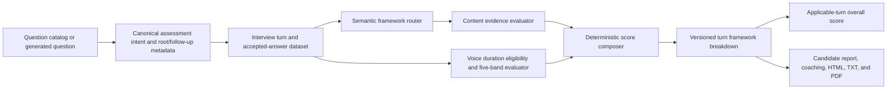

# Impact-first Past Example Scoring — Outline Plan

> **Status:** Outline only. Research is complete and ready for planning; no phase is in progress.
>
> **Purpose:** Show the complete end state and phase boundaries before any phase receives a detailed XML-tag implementation plan.
>
> **Source of truth:** `research.md`. If a later XML plan conflicts with the human-aligned rules in that file, the XML plan must stop and surface the conflict.

## Outline boundary

This document defines what the finished feature should look like, the order in which it should be built, and the verification gate for each phase. It intentionally does not define exact function signatures, line-level patches, XML tags, commits, deployment, or live catalog activation.

Implementation starts only when the owner explicitly requests a phase-specific XML plan and then authorizes that phase. At that time, create one `codex/` feature branch and keep every phase on that branch. The feature is released once, after all phases pass; there is no temporary or shadow scoring release.

Each future phase is a separate bounded task contract. Default budget per phase:

- At most 5 production files and 3 focused test files.
- Fewer than 400 incremental changed lines where practical.
- No more than 3 implementation cycles: implement, focused repair, independent audit repair.
- If an XML plan forecasts more than 10 task-owned files or 500 incremental lines, split that phase before implementation.

## Final product outcome

When the feature is complete:

1. Every question whose semantic intent asks for a genuine past example uses the **Impact-first Past Example** framework, even when it does not literally say “Tell me about a time”.
2. Scenario, knowledge, motivation, self-introduction, conversation, clarification, repair, and candidate-question turns retain evidence-appropriate handling; technical keywords and seniority wording cannot silently change framework identity.
3. A past-example root answer is assessed on seven score-bearing components:

   | Component | Weight |
   |---|---:|
   | Outcome evidence | 20 |
   | Problem solving | 15 |
   | Personal role | 15 |
   | 2–3 approaches / actions / decisions | 20 |
   | Learning | 10 |
   | Outcome-first placement | 10 |
   | Voice duration | 10 |

4. Every component uses five component-specific evidence levels. Level 1–5 contributes `0% / 25% / 50% / 75% / 100%` of that component’s weight.
5. Outcome can receive evidence credit from a quantitative result or an explicit before/after, target/actual, or selected/alternative comparison. A generic positive claim is not enough.
6. A result stated only at the end can still receive Outcome evidence credit, but receives Level 1 for Outcome-first placement. A clear result/comparison in the first one or two sentences receives Level 5 placement credit.
7. Approaches may be technical or non-technical. Strong credit requires two or three substantive, question-relevant approaches/actions/decisions with rationale and relevant trade-off or verification—not a list of tools.
8. Every substantive root voice answer, across all content frameworks, receives the same 10% duration assessment when reliable duration evidence exists:

   | Level | Eligible root-answer duration |
   |---|---|
   | 1 | `<60` or `>150` seconds |
   | 2 | `60–69` or `141–150` seconds |
   | 3 | `70–79` or `131–140` seconds |
   | 4 | `80–89` or `121–130` seconds |
   | 5 | `90–120` seconds |

9. Short follow-ups, transcript confirmation, clarification, repair, repeat requests, acknowledgements, and candidate questions do not receive duration penalties. Missing or unreliable system duration evidence is `not_applicable`, not a candidate zero.
10. Text interview content can use the new past-example framework, but text timing remains out of scope. When duration is not applicable, content is normalized without creating a missing 10-point penalty.
11. The candidate report shows the framework name, Level 1–5, earned points versus weight, a short evidence-based reason, and the main improvement target. It never presents the coaching score as a hiring verdict.
12. Candidate-facing coaching consistently says `90–120 seconds`; question-count mismatch, `>90 seconds`, or missing timing evidence cannot independently trigger “too long” advice.
13. New reports carry an internal scoring/framework version. Existing reports are not migrated, backfilled, or regenerated automatically.

## Final user-visible experience

### During the interview

- A genuine past-example root question clearly asks for one real example and encourages the candidate to start with the outcome.
- Follow-ups target one missing evidence area at a time, such as personal ownership, comparison, rationale, or learning.
- Follow-up metadata remains linked to the root question. Follow-ups do not become additional duration-scored root answers.

### In the report

- The turn card title identifies **Impact-first Past Example** when applicable.
- The card displays seven components for eligible voice past-example answers and six content components when voice duration is unavailable or not applicable.
- Each component displays Level `1/5` through `5/5`, its point contribution, and a grounded explanation based on the candidate’s answer or measured voice evidence.
- The report can say, for example, that the outcome itself was strong while placement was weak because it appeared only in the closing sentence.
- Non-past-example answers keep their existing content framework but use the same cross-framework 10% duration rule for eligible voice root answers.
- HTML, candidate projection, text export, and PDF remain semantically consistent.

## Target data flow

Business-rule ownership in the final design:

- Question metadata owns assessment intent; prompt keywords do not.
- The content evaluator owns evidence levels and evidence rationale.
- The duration evaluator owns eligibility and band mapping.
- The deterministic score composer owns weights, normalization, denominator inclusion, and versioning.
- Candidate projection owns the public allowlist; UI utilities do not invent or rescore evidence.

## Scope

- Voice duration evidence, eligibility, bands, metrics, and coaching.
- Cross-framework 10% voice-duration score composition.
- Semantic past-example routing for source catalogs 2026.1 and 2026.2 plus generated questions.
- Impact-first framework definitions, evidence anchors, deterministic point calculation, and reasons.
- Root/follow-up wording and metadata needed to elicit the aligned structure.
- Report score composition, denominator safety, versioned persistence, candidate projection, UI, and exports.
- Focused calibration fixtures, cross-layer verification, one owning Feature RFC update, and one scoped change-log entry.

## Non-goals

- Text-answer timing, typing-time measurement, or estimated speaking time.
- Old-report backfill, migration, automatic regeneration, or numerical comparability claims.
- Replacing scenario, knowledge, motivation, or self-introduction content rubrics with Impact-first.
- Redesigning voice STT, TTS, VAD, latency, barge-in, or transcript-confirmation behaviour beyond consuming already accepted duration metadata.
- A new candidate report visual system; reuse the existing turn-card language and layout unless the later UI approval explicitly broadens scope.
- A hiring recommendation, pass/fail decision, job-match verdict, or claim of psychometric validation.
- Live Mongo catalog activation, deployment, push, or release without separate approval.
- Real-provider evaluation runs without credentials, cost clarity, and explicit approval.

## Phase sequence

| Phase | Outcome | Depends on | Released separately? |
|---|---|---|---|
| 1 | Voice duration becomes a trustworthy, eligible, five-band assessment input | Research | No |
| 2 | Question intent and framework routing become semantic and metadata-owned | Phase 1 contract boundary | No |
| 3 | Impact-first content receives grounded five-level evaluation | Phase 2 | No |
| 4 | Turn and overall scoring use the aligned weights, duration composition, and denominator rules | Phases 1–3 | No |
| 5 | Root questions and follow-ups elicit the framework without corrupting root scoring | Phases 2–4 | No |
| 6 | Candidate-safe report data and coaching publish one consistent interpretation | Phases 1–5 | No |
| 7 | UI and exports render the published interpretation without rescoring | Phase 6 | No |
| 8 | Calibration, cross-layer QA, documentation, and single-release readiness | Phases 1–7 | No; readiness only |

## Phase 1 — Voice duration truth and five-band assessment [planned]

- Phase goal: Turn persisted voice speaking duration into one canonical, evidence-backed assessment for every eligible substantive root voice answer, before broader framework scoring is changed.
- Affected components: Expected backend boundary includes `voiceDeliveryAnalyzerService.js`, `reportTurnDatasetService.js`, `reportEvidenceAnalysis.js`, `reportGeneratorAgent.js`, and one small planned duration-scoring helper. Frontend display changes are deferred to Phase 6.
- Data flow: Accepted voice user turn metadata -> root/follow-up and excluded-turn eligibility -> reliable `speakingDurationSeconds` -> Level 1–5 plus `0/2.5/5/7.5/10` points -> turn/report metrics. Text and missing/unreliable duration -> `not_applicable`.
- Pseudocode: Resolve accepted root-answer eligibility; reject repair/clarification/follow-up/system/candidate-question turns; read persisted duration; map exact boundaries to one level; return `{ eligible, reason, seconds, level, earnedPoints }`; expose the same object to later score composition and coaching.
- Edge cases: Exact boundaries at 60/70/80/90/120/130/140/150; absent VAD duration; duplicate or stale summary data; low-confidence/unconfirmed transcript; root answer followed by short probes; text-mode report; system measurement failure. A system evidence failure must not become a candidate zero.
- Tests: Extend `voiceDeliveryAnalyzerRobustness.test.js` and `reportTurnDatasetRobustness.test.js`; add or extend one focused duration-band/report-metric test. Prove every boundary, exclusion, and `not_applicable` path deterministically.
- Completion criteria: One canonical duration assessment exists; 90–120 maps to Level 5; a 100-second answer is not “overlong”; excluded turns never enter duration aggregates; text/missing evidence is not penalized; no second temporary scoring path exists.

## Phase 2 — Semantic assessment intent and framework routing [planned]

- Phase goal: Make explicit question intent—not wording keywords or seniority suffixes—select the answer framework consistently.
- Affected components: Expected boundary includes `questionCatalogSelectionService.js`, `questionPoolComposerService.js`, `masterAiService.js`, `turnRubricService.js`, and directly related metadata normalization only.
- Data flow: 2026.1/2026.2 catalog item or generated question -> canonical `evidenceMode`/assessment intent -> interviewer output -> transcript question metadata -> report router -> `impact_first_past_example`, scenario, knowledge, self-introduction, motivation, or direct framework.
- Pseudocode: Prefer explicit canonical intent; infer only when source metadata is absent; map every semantic `past_example` root to Impact-first; preserve parent/root intent on follow-ups; prevent technical keywords or seniority decoration from overriding explicit intent; keep scenario/knowledge routes separate.
- Edge cases: “What project are you most proud of?” without literal Tell-me wording; non-technical conflict/teamwork examples; “How would you…” scenarios; repeated-workflow questions; senior prompts containing “trade-offs”; both source catalog versions; generated questions with incomplete metadata.
- Tests: Extend `questionCatalogSelectionService.test.js`, `questionMetadataPersistence.test.js`, and `roleSpecificFrameworkRobustness.test.js` with a parameterized routing matrix covering both catalogs and all seniority variants.
- Completion criteria: Every semantic past-example root routes to Impact-first; scenario/knowledge/motivation/self-introduction routes remain correct; the same family cannot change framework only because of seniority wording; both catalogs are supported without assuming which one is live.

## Phase 3 — Grounded five-level Impact-first evaluator [planned]

- Phase goal: Produce an auditable Level 1–5 assessment for each aligned Impact-first content component from candidate-authored evidence.
- Affected components: Expected boundary includes `answerFrameworkService.js`, `turnRubricService.js`, existing answer-evidence signal extraction, one planned Impact-first analysis service, and existing framework normalization utilities.
- Data flow: Canonical past-example question + accepted root answer + question metadata -> grounded content evidence -> six content levels and reasons -> weighted content points out of 90 -> framework breakdown. Phase 1 supplies duration separately.
- Pseudocode: Extract outcome/comparison, problem/reasoning, personal ownership, distinct substantive approaches, learning, and outcome position; map each component to its own five anchors; require candidate-authored evidence for credit; apply conditional trade-off/risk/validation evidence only when relevant; calculate points deterministically from level and weight.
- Edge cases: Strong metric with no attribution; qualitative comparison; result only in closing sentence; no result; “we” without personal role; one strong approach versus two thin approaches; three tool names without rationale; negative/failure outcome; non-technical approaches; generic lesson; answer containing question wording but no candidate evidence.
- Tests: Add a focused Impact-first scoring fixture/test and extend `reportFrameworkPipeline.test.js` plus `roleSpecificFrameworkRobustness.test.js`. Include labelled examples at all five levels and adversarial keyword-only answers.
- Completion criteria: All six content components expose level, weight, earned points, reason, and grounded evidence; the weights total 90; outcome quality and placement are independently scored; identical evidence produces deterministic points; keyword presence alone cannot earn strong credit.

## Phase 4 — Score composition, denominator integrity, and versioning [planned]

- Phase goal: Make the aligned framework and cross-framework duration assessment change new report scores exactly once, without synthetic zeros or text-mode penalties.
- Affected components: Expected boundary includes `reportScoreService.js`, `reportGeneratorAgent.js`, `reportDraftBuilder.js`, `reportScoringExplanationService.js`, and existing report/schema normalization as needed; no database migration is expected unless XML research disproves the current `Mixed` boundary.
- Data flow: Content framework score + Phase 1 duration assessment -> voice root score (`90% content + 10% duration`) or non-duration score (content renormalized to 100%) -> applicable-turn denominator -> overall interview performance -> versioned report breakdown and explanation.
- Pseudocode: For eligible voice roots, scale non-Impact content to 90 and add duration points; for Impact-first, add its 0–90 content points and duration points; for text/ineligible/missing duration, preserve a 0–100 content score; exclude conversation and zero-dimension/non-applicable turns; average only applicable scores; persist framework/scoring version.
- Edge cases: Direct rubric with zero dimensions; genuine zero-evidence answer; missing duration; text past-example answer; scenario voice answer; root plus follow-up chain; legacy report read; report regeneration after cutover; partial provider feedback; duplicate question text with distinct IDs.
- Tests: Extend `reportFrameworkPipeline.test.js`, `reportScoringExplanationService.test.js`, and `reportFrameworkSchema.test.js` with exact score arithmetic, denominator, version, text/voice, and legacy-read cases.
- Completion criteria: Accepted weights produce exact expected totals; no zero-dimension turn depresses the denominator; missing system duration does not penalize; every eligible voice root uses the same 10% rule; text timing remains absent; old reports remain readable and untouched; new score explanations name the applicable framework/version.

## Phase 5 — Past-example question wording and controlled follow-ups [planned]

- Phase goal: Elicit complete Impact-first answers naturally and target missing evidence without creating duplicate root scores or duration penalties.
- Affected components: Expected boundary includes both source catalog seed files, `interviewerAgentQuestionBuilder.js`, `interviewerAgent.js`, follow-up metadata flow, and root/follow-up report dataset handling. Live catalog seeding remains separately approved work.
- Data flow: Semantic past-example root contract -> candidate-facing root wording -> accepted root answer -> missing-evidence target -> one controlled follow-up carrying `rootQuestionId`, `parentQuestionId`, intent, and targeted dimension -> supplemental report evidence linked to the root.
- Pseudocode: Ask for one genuine example and encourage outcome-first delivery; preserve domain-appropriate language; select at most one missing evidence target per follow-up; keep follow-up on the same example; link it to the root; do not award a second duration score or denominator entry; do not retroactively repair the root answer’s original placement/duration score.
- Edge cases: Conflict/teamwork examples with no technical content; underperforming project with a negative result; candidate already supplied all evidence; follow-up asks only for ownership; follow-up answer is short; multiple follow-up depth; clarification/repair mistaken for a content probe; source catalog version not known live.
- Tests: Extend `questionCatalog2026_2.test.js` with shared 2026.1/2026.2 expectations, `followUpQuestionService.test.js`, and `rootFollowUpRuntimeFlow.test.js`.
- Completion criteria: Applicable root wording clearly elicits the aligned structure; technical depth is conditional; follow-ups target one missing component and preserve root linkage; no follow-up becomes an extra duration-scored root or silently repairs Outcome-first placement; non-past-example wording remains unchanged.

## Phase 6 — Candidate-safe report contract and coaching [planned]

- Phase goal: Publish one candidate-safe score/coaching contract that frontend and export surfaces can render without interpreting or recomputing scoring rules.
- Affected components: Expected backend boundary includes `reportCoachingService.js`, `reportCoachingBuilder.js`, `reportPublicationSummaryService.js`, and the nearest existing candidate projection/normalization owner confirmed by the XML plan.
- Data flow: Versioned framework breakdown + duration assessment -> private/internal evidence filtering -> candidate-safe Level/points/reason contract -> improvement priorities and coaching payload -> frontend/API consumers.
- Pseudocode: Allowlist framework identity, level, weight, earned points, safe reason, duration applicability, and version; remove private evidence references; derive coaching from measured duration band and the main content gap; remove question-count causality and every 60–90/under-90 recommendation; preserve legacy payloads without fabricating new fields.
- Edge cases: Duration unavailable; text report; legacy report without levels/version; non-past framework with voice duration; a 100-second answer; Level 1 Outcome-first with strong Outcome evidence; duplicate questions; model feedback attempting to overwrite deterministic fields.
- Tests: Extend `reportCoachingAndStarReview.test.js`, `reportPublicationSummary.test.js`, and the nearest existing report projection/QA test selected by the XML plan.
- Completion criteria: Candidate payload contains one authoritative set of levels, points, reasons, duration applicability, and 90–120 coaching; a 100-second answer never triggers overlong advice; question-count mismatch never causes concision advice; private evidence and model overrides are blocked; legacy/missing fields fail safe.

## Phase 7 — Candidate UI and export consistency [planned]

- Phase goal: Render the Phase 6 contract consistently in the existing candidate report layout, text output, and PDF without client-side rescoring.
- Affected components: Expected frontend boundary includes `frontend/src/utils/reportView/coaching.js`, `TurnBreakdownSection.jsx`, `reportPdfTemplate.js`, and the existing text/download formatter identified by the XML plan. Reuse the current layout unless explicit UI approval broadens scope.
- Data flow: Candidate-safe report payload -> report view model -> framework turn card and coaching -> HTML, text download, and PDF. Every surface reads server-calculated fields directly.
- Pseudocode: Display framework title; show each applicable component with Level, earned/available points, and reason; show duration only when applicable; preserve non-past framework labels; remove 60–90/under-90 and `>90` overlong logic; keep unavailable/legacy states neutral.
- Edge cases: Duration unavailable; text-mode report; legacy report; non-past framework with voice duration; strong Outcome with weak placement; duplicate questions; optional export fields; narrow mobile layout; very long evidence reason.
- Tests: Extend `crossRoleReportFallbacks.test.js`, `TurnBreakdownSection.test.jsx`, and `reportTurnFrameworkFormatter.test.js` with HTML/coaching/PDF/legacy assertions; the XML plan must identify the exact text-export owner before editing.
- Completion criteria: HTML, coaching, text, and PDF agree on framework, levels, points, reasons, and 90–120 guidance; no client surface rescores; legacy and unavailable states remain readable; the minimal card proposal receives required UI approval before implementation.

## Phase 8 — Calibration, integrated verification, documentation, and release readiness [planned]

- Phase goal: Demonstrate that the complete branch implements the aligned contract consistently and is ready for one owner-controlled release.
- Affected components: No new product feature surface. Verification spans the directly affected backend/frontend contracts; documentation is limited to `F-34-report-generation-pipeline.md` plus one scoped `repo-docs/change-log.md` entry via the required auto-docs-sync workflow.
- Data flow: Labelled routing/scoring/duration fixtures -> focused tests -> cross-package score/report flow -> candidate projection and browser fixture -> independent scoring auditor -> evidence matrix -> owner release decision.
- Pseudocode: Run focused phase suites first; run backend/frontend cross-package gates required by the final contract; execute one independent T3 auditor against task-owned changes and acceptance criteria; repair only confirmed gaps; validate docs against final code; produce readiness report without pushing or deploying.
- Edge cases: Mock-only provider evidence; unavailable real credentials; unverified live Mongo catalog; legacy reports; candidate privacy allowlist; scoring disagreement between fixture and evaluator; browser fixture versus live backend distinction; concurrent dirty worktree changes.
- Tests: Run all phase-focused suites, backend lint, frontend lint/quality checks, and the proportionate full backend/frontend gates for this cross-layer scoring change. Run a headed browser report fixture if locally available. Real AI evals, live provider, live Mongo activation, deployment, and production verification remain `NOT RUN` unless separately approved.
- Completion criteria: Every phase criterion passes; the independent auditor returns a final evidence matrix with no blocking finding; candidate/private boundaries hold; F-34 and the single change-log entry match verified behaviour; no unrelated files are attributed; the branch is ready for owner review but is not committed, pushed, seeded, deployed, or released without explicit approval.

## End-to-end acceptance criteria

The complete feature is ready only when all of the following are true:

1. A routing matrix proves semantic past-example coverage across both source catalogs and all seniority variants without scenario/knowledge false positives.
2. Five-level fixtures prove each component’s anchors, including generic-keyword negative cases and cross-domain approaches.
3. Exact arithmetic proves the aligned weights and Level contribution mapping.
4. Exact boundary tests prove all five duration bands and every exclusion.
5. Missing duration is non-applicable; text timing remains untouched; eligible voice duration contributes exactly 10% across frameworks.
6. Zero-dimension/non-applicable turns do not enter the overall denominator, while genuine zero-evidence applicable answers still do.
7. Root question wording and targeted follow-ups preserve semantic intent and root linkage without duplicating score or duration.
8. Candidate report cards, coaching, HTML, TXT, and PDF agree and contain no `60–90`, `under 90`, or `>90 means overlong` logic.
9. New reports are versioned; existing reports remain readable and receive no backfill.
10. Focused tests, required package gates, browser fixture, independent T3 audit, and scoped documentation evidence are recorded separately from live/provider/production claims.

## XML-plan handoff rule

When the owner later requests a phase, create an XML-tag plan only for that phase. The XML plan must:

- Reinspect the exact current files and dirty baseline for that phase.
- Name each object, contract, function/helper, caller, input, output, side effect, dependency, and failure behaviour.
- Map every completion criterion to focused tests before implementation.
- Preserve this outline’s phase boundary and non-goals.
- Stop for approval if the phase exceeds its file/line budget, changes the accepted product rules, requires a UI layout expansion, needs live catalog mutation, or introduces a paid/new provider call.

After writing the requested phase’s XML plan, stop. Implementation begins only on a separate explicit instruction.
