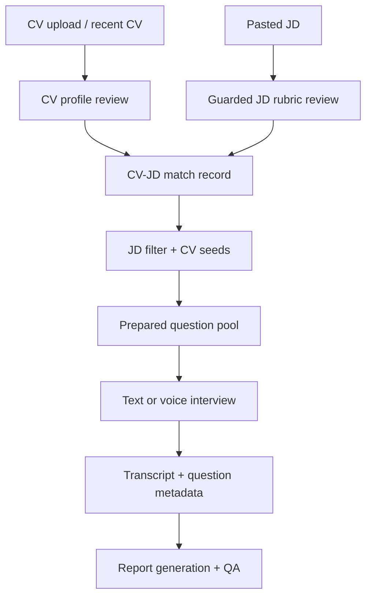

# 产品流程关系图

这页把多个 workflow 的关系放在一起。主 walkthrough 只追 text interview 主路径；这里展示其他 feature 如何接入同一个证据链。

## 准备到访谈的阶段关系

这个 diagram 显示状态交接关系：输入 review 是 match 的前提，match 和 question artifacts 是访谈控制的材料，accepted transcript 才是报告计分的基础。

## 运行时分支

| 阶段 | 正常路径 | 降级或边界 | 主要源码 |
| --- | --- | --- | --- |
| CV/JD 准备 | 用户确认 parsed CV 与 structured JD | JD safeguard 可要求 review；CV seed refresh 失败不应阻断保存 | [CV/JD 准备页](modules/feature-cv-jd-preparation.md) |
| Match/question prep | 生成 match record、JD filter、question pool | JD filter 或 pool composition warning 后继续 | [match 和问题准备页](modules/feature-match-and-question-prep.md) |
| Text interview | 保存 answer，调用 adaptive controller | time/question limit 或 no unique question 结束 | [访谈控制页](modules/feature-interview-control.md) |
| Voice interview | WebSocket、STT gate、TTS streaming、barge-in | low-confidence contentful transcript 要 confirmation | [voice 页](modules/feature-voice-interview.md) |
| Recording | IndexedDB 本地持久后后台上传 | MP3 conversion 与 report readiness 分离 | [recording 页](modules/feature-recording.md) |
| Report | report generator + QA + bounded repair | blocking flags 让 report 非 ready | [report 页](modules/feature-report-and-qa.md) |

## 数据和证据走向

RAG 当前把 session artifacts 与 global question banks 写入 `document_chunks`，访谈和报告使用 retrieval bundle 作为上下文。它不是系统唯一的事实来源；CV/JD review、match records、question pool、transcript metadata、report QA 都在各自层面继续守住输出。

下一步可读 [当前 RAG 怎么做](modules/rag-retrieval.md)，或直接跳到 [验证与保护层](modules/validations-and-guards.md) 看每一层在哪里拒绝、降级或标记风险。

证据状态：除特别标注外，本页基于当前源码已确认。

